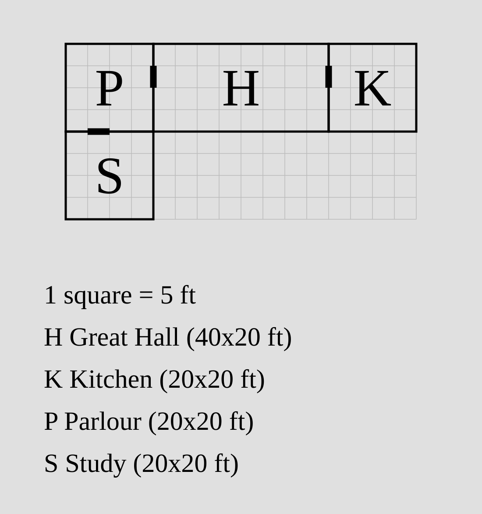

# porta

A small CLI that turns a concise, **relational** text spec of a building's
layout into a clean, printable **SVG** floor plan — for tabletop-RPG session
prep.

You describe rooms by their size and how they sit against one another; `porta`
solves the geometry and renders it. No mouse, no coordinates to hand-pack,
diffable in git.

```porta docs/img/readme.svg
room hall    "Great Hall" 40x20 root
room parlour "Parlour"    20x20 left-of hall
room kitchen "Kitchen"    20x20 right-of hall
room study   "Study"      ?x20  down-of parlour
```



Rooms attach **flush**, one relation per axis (`up-of` / `down-of` / `left-of` /
`right-of`); positions are derived, not authored. A dimension can be `?` to let
a neighbour decide it, and a door is drawn on every shared wall by default.

## Installation

`porta` will be published to PyPI with its first release:

```sh
pip install porta      # or: uvx porta draw plan.porta -o plan.svg
```

Until then — or to work on a local checkout — install it from source with
[uv](https://docs.astral.sh/uv/):

```sh
uv add --editable path/to/porta   # depend on it from another project
```

## Usage

```sh
porta draw plan.porta -o plan.svg    # render to an SVG file (omit -o for stdout)
porta draw plan.porta --debug-ascii  # print the solved layout as an ASCII grid
```

From a source checkout, prefix with `uv run` (e.g. `uv run porta draw …`).

A plan that can't be solved — an unknown anchor, an overlap, a room that shares
no wall with its anchor — is reported as `file:line: error: …` with a non-zero
exit code.

## Documentation

- [**Rooms**](docs/room.md) — the `room` statement: ids, names, dimensions,
  relations, alignment, shifting, and auto-dimensions (`?`).
- [**Doors**](docs/door.md) — the default doors, and how to resize, move,
  remove, and add them.
- [**Design note**](docs/design.md) — the canonical spec and the reasoning
  behind it.
- [`examples/manor.porta`](examples/manor.porta) — a fuller worked plan.

Not yet supported (tracked as issues): non-rectangular rooms, windows,
multi-floor plans, and richer styling. See the design note for scope and
phasing.

## Develop

```sh
uv run porta --help
uv run --extra dev pytest
```
