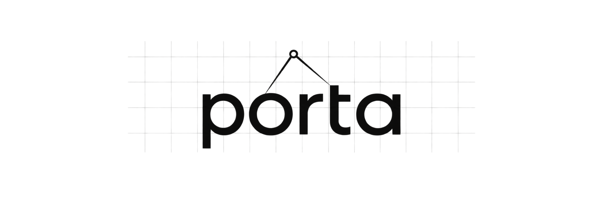
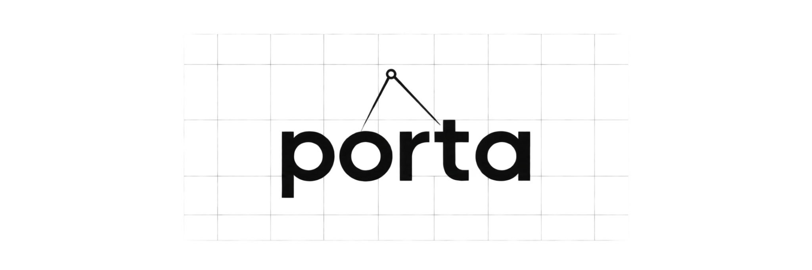

# Banner options

Three variations generated with GPT Image 2.5 Sunburst through the API, asking for equal-length divider legs with tips retained on **o** and **t**. These are visual prototypes; the generated geometry is approximate.

## Original

## First revision

## Option 1

## Option 2

## Option 3

