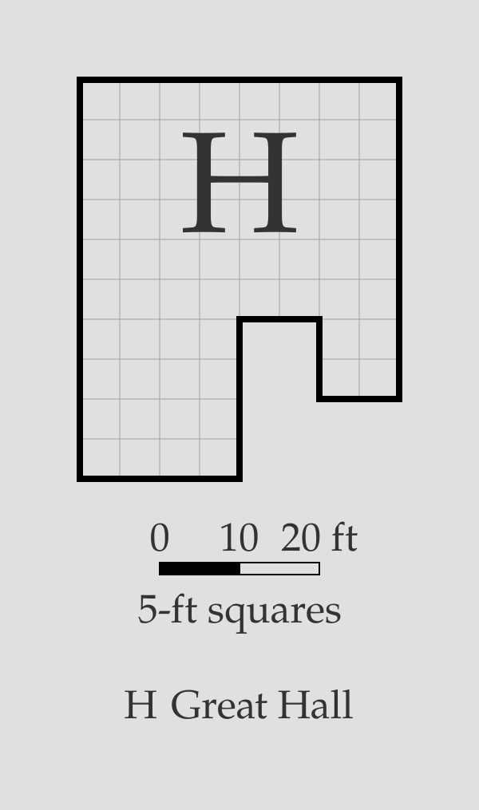
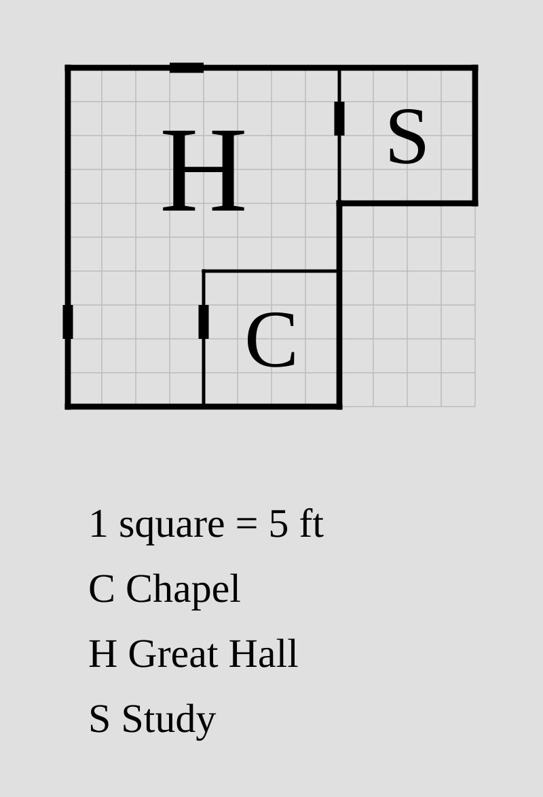
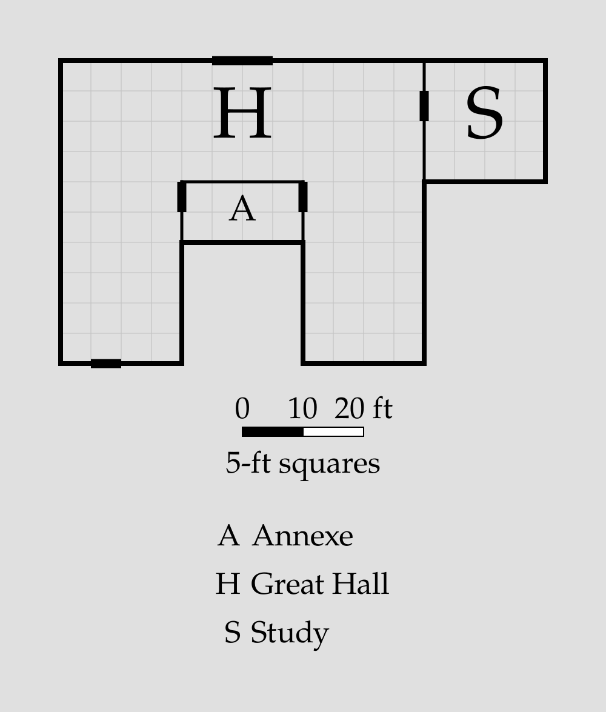

# Blocks

A **block** joins several rooms into one, possibly non-rectangular, room. You
write each rectangle as an ordinary [room](room.md), then a `block` line groups
them: the walls they share *with each other* are dropped, so they read as a
single space.

```porta img/block-l.svg
room main "" 40x30 root
room wing "" 20x20 down-of main
block hall "Great Hall" main wing
```



The two rectangles become one L-shaped Great Hall: the wall between them (and its
default door) is gone, and the union has a single glyph and one key entry.

> [!NOTE]
> A block is purely a grouping. Its members are placed by the usual relations,
> so positioning a non-rectangular room is no harder than positioning the
> rectangles it's made of — there's no new geometry to reason about.

## The block statement

```
block <id> ["<name>"] [glyph=<member>] <member-id>...
```

- **`<id>`** — the block's own id; its first letter is the union's glyph.
- **`"<name>"`** — optional, and labels the union in the key. Omit it and the
  key shows just the glyph (a union has no single size to fall back on).
- **`glyph=<member>`** — optional; which member the glyph is drawn in (default:
  the first member listed).
- **`<member-id>...`** — the rooms that make up the union, by id.

The members are declared as rooms elsewhere (before or after the block line);
the block just references them by id.

## Members are ordinary rooms

A block's members are normal [room](room.md) statements, so they keep everything
a room can do — relations, `align` / `shift`, `?` auto-dimensions, and
[doors](door.md) to rooms *outside* the block:

```porta img/block-neighbour.svg
room main  ""      40x30 root
room wing  ""      20x20 down-of main
room study "Study" 20x20 right-of main
block hall "Great Hall" main wing
```



`study` attaches to the member `main` like any rectangle and gets the usual door
on their shared wall — only walls *between members of the same block* are
dropped.

Members are normally written without a name, since the block names the union. A
member that does carry a name keeps it in the source, but it's suppressed in the
output and `porta` prints a warning.

## What a block drops

Between two members of the same block, `porta` drops both the **wall** they
share and the **door** on it:

- the default door silently (that's the whole point of a block), and
- any door you wrote *explicitly* — a `door=` / `door@` modifier on the relation
  between two members, or a standalone `door <a> <b>` — with a **warning**, since
  that door cannot appear.

External doors (`door <member> outside <side>`) on the union's outer boundary
work exactly as they do for a plain room.

## Invalid blocks

`porta` rejects a block it can't form:

- A member id that isn't a room.
- A room listed in more than one block.
- A `glyph=` target that isn't one of the members.
- Members that don't form a single contiguous region (a gap between them).

## Putting it together

```porta img/block-capstone.svg
room back  ""      60x20 root
room west  ""      20x30 down-of back
room east  ""      20x30 down-of back align=end
room study "Study" 20x20 right-of back align=end
block hall "Great Hall" back west east
```



A U-shaped **Great Hall** from three rectangles — a back wall with two wings —
joined into one room, with a **Study** off the east end. The walls inside the U
are gone; the door between the hall and the study remains.
