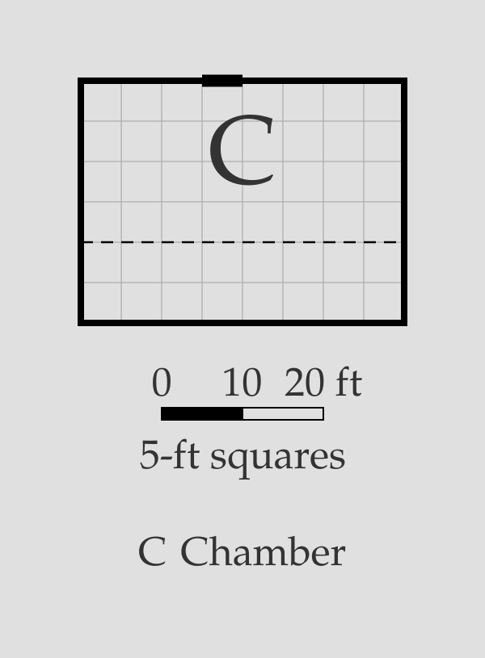
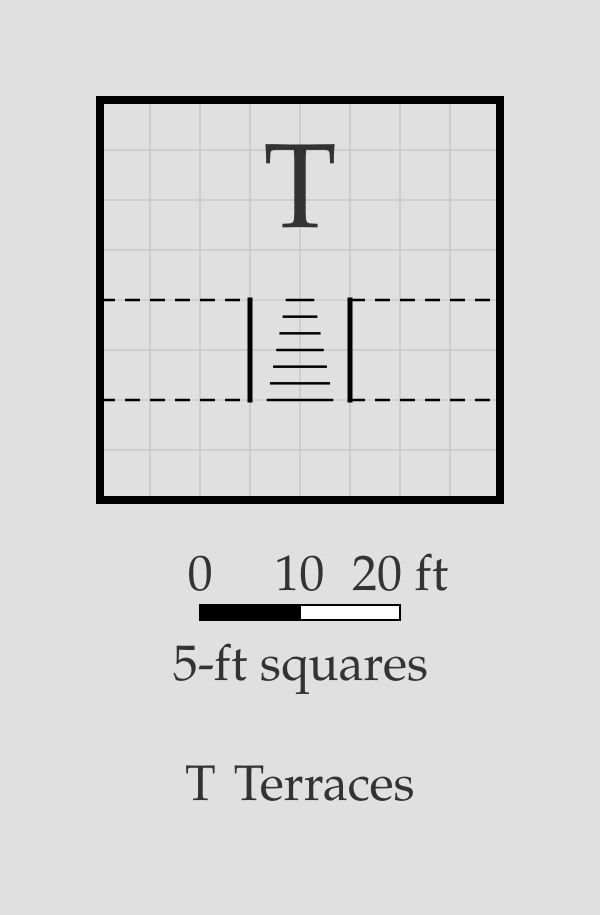
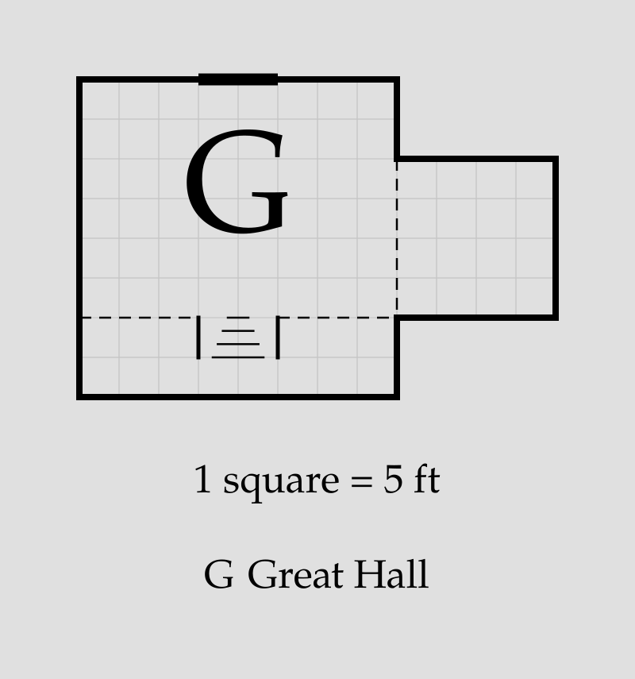

# Dividers

A **divider** statement draws the suppressed boundary between two
[block](block.md) members back in as a thin dashed dividing line — here,
the edge of a chamber's raised half:

```porta img/divider.svg
room low "" 40x20 root
room high "" 40x10 down-of low
block chamber "Chamber" low high
divider low high
stairs in low down=up size=10x10 at=15,10
door low outside up
```



## The `divider` statement

```
divider <member-id> <member-id>
```

- The two rooms are given by [ID](room.md#room-id) and must be **members of
  the same block**, sharing a wall.
- The divider runs the whole shared edge — only the overlapping span, when
  the two members overlap partially.
- A divider is purely visual: it does not affect placement, doors, or
  [stairs](stairs.md) validation, and does not appear in the ASCII
  rendering. It is a dividing line, not a wall — the space is still one
  block, with one glyph and one key entry.

## Stairs on a divider

Where a stair **entrance** (an open end of a flight, in either room) lies
on the boundary, the divider is cut over its span: the flight is entered
and left across the boundary, and an unbroken line over the open end
would redraw it as a closed flight leaving the floor. A *closed* side or
flank flush with the boundary keeps the line — the flight is walled off
from the other half.

```porta img/divider-stairs.svg
room lower "" 40x20 root
room mid "" 40x10 down-of lower
room upper "" 40x10 down-of mid
block terraces "Terraces" lower mid upper
divider lower mid
divider mid upper
stairs in mid down=up size=10x10 at=15,0
```



Here one flight spans the middle terrace: both its ends are open (`in`
[sense](stairs.md#reading-the-symbol)), one on each boundary, so each
divider is cut at the end that lies on it.

## Invalid dividers

`porta` rejects a divider it can't draw:

- A room ID that isn't a room.
- Rooms that are not members of the same block.
- Members that share no wall.
- Two dividers on the same boundary.

## Putting it together

```porta img/divider-capstone.svg
room hall "" 40x30 root
room dais "" 40x10 down-of hall
block great "Great Hall" hall dais
divider hall dais
stairs in dais down=up size=10x5 at=15,0
door=10 hall outside up
```

The [stairs capstone](stairs.md#putting-it-together)'s great hall, with
its dais edge made explicit: the divider runs the width of the hall and
breaks at the steps' upper entrance.


