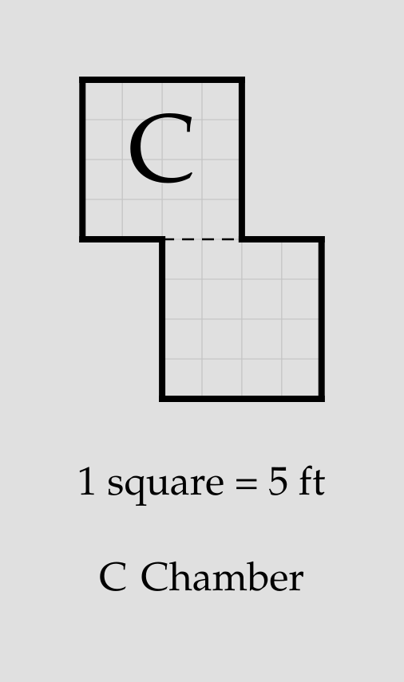

# Dividers

A **divider** statement draws the suppressed boundary between two
[block](block.md) members back in as a thin dashed dividing line:

```porta img/divider.svg
room low "" 40x20 root
room high "" 40x10 down-of low
block chamber "Chamber" low high
divider low high
door low outside up
```


Adjacent [exterior rooms](room.md#exterior-spaces) automatically get the same
thin dashed divider, including incidental contacts and component links.
Exterior members of the same block merge without an automatic divider;
an explicit statement restores it. Exposed outdoor edges remain unmarked.

An explicit divider on a boundary that already has an automatic one draws
only one line. Two explicit declarations on the same boundary are still an error.

## The `divider` statement

```
divider <room-id> <room-id>
```

- The two rooms are given by [ID](room.md#room-id) and must share an edge.
  They must either both be exterior, or both be interior members of one block.
  An interior/exterior wall cannot be replaced with a divider.
- A divider is purely visual: it does not affect placement, doors, or
  [stairs](stairs.md) validation, and does not appear in the ASCII
  rendering. It is a dividing line, not a wall. Members of a block still share
  one glyph and one key entry.

The divider runs the whole shared edge; when the two members overlap
partially, that is only the overlapping span:

```porta img/divider-offset.svg
room low "" 20x20 root
room high "" 20x20 down-of low shift=10
block chamber "Chamber" low high
divider low high
```



## Stairs on a divider

Where a stair **entrance** (an open end of a flight, in either room) lies
on the boundary, the divider is cut over its span: the flight is entered
and left across the boundary, and an unbroken line over the open end
would redraw it as a closed flight leaving the floor. A *closed* side or
flank flush with the boundary keeps the line — the flight is walled off
from the other half.

```porta img/divider-stairs.svg
room lower "" 40x20 root
room mid "" 40x10 down-of lower
room upper "" 40x10 down-of mid
block terraces "Terraces" lower mid upper
divider lower mid
divider mid upper
stairs in mid down=up size=10x10 at=15,0
```


Here one flight spans the middle terrace: both its ends are open (`in`
[sense](stairs.md#reading-the-symbol)), one on each boundary, so each
divider is cut at the end that lies on it.

## Invalid dividers

`porta` rejects a divider it can't draw:

- A room ID that isn't a room.
- Interior rooms that are not members of the same block.
- An interior room and an exterior room.
- Members that share no wall.
- Two dividers on the same boundary.

## Putting it together

```porta img/divider-capstone.svg
room hall "" 40x30 root
room dais "" 40x10 down-of hall
room wing "" 20x20 right-of hall shift=10
block great "Great Hall" hall dais wing
divider hall dais
divider hall wing
stairs in dais down=up size=10x5 at=15,0
door=10 hall outside up
```

The [stairs capstone](stairs.md#putting-it-together)'s great hall, with a
wing added and both boundaries drawn. The hall–dais divider runs the
width of the hall and breaks at the steps' upper entrance; the hall–wing
divider runs unbroken down the stretch of edge the two rooms share, while
the rest of that edge — where only the hall stands — remains the block's
solid outer wall.


