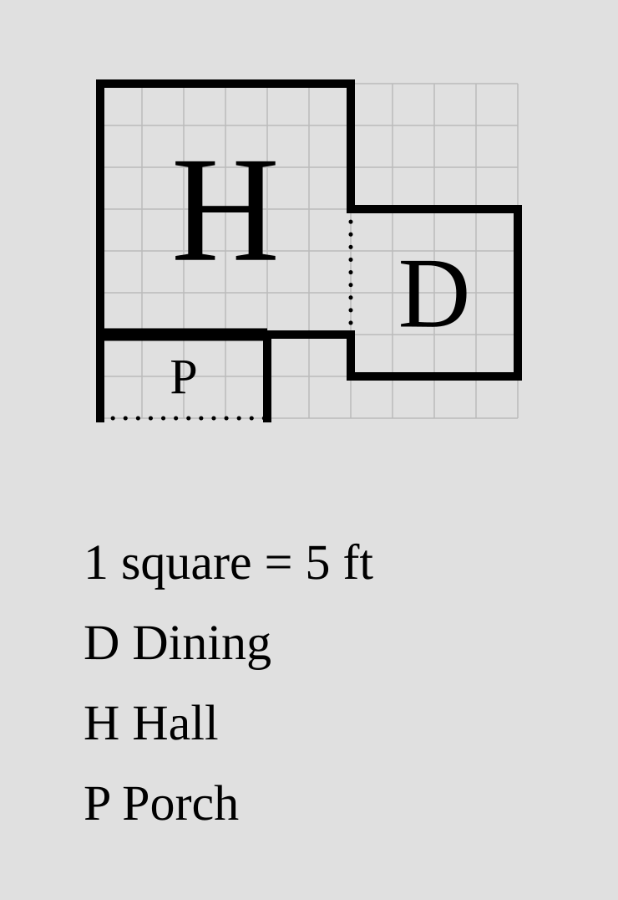
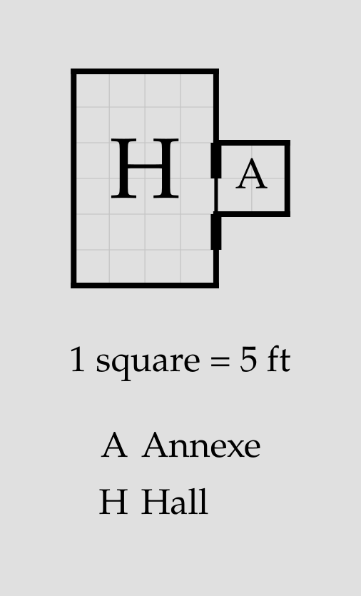
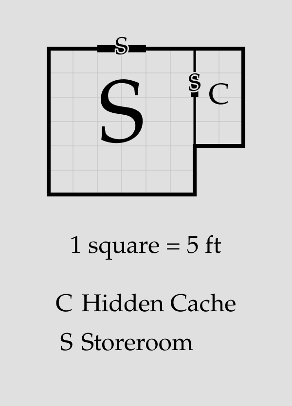

# Doors

By default, `porta` draws a **door** on every wall between a declared
[room](room.md) and its anchor. Explicit [door declarations](#door-declarations)
and [statements](#the-door-statement) are needed only to change a door from
its default settings (remove it, resize it, move it) or to add an additional door
in a non-default location.

> [!NOTE]
> Doors are drawn as thick black marks straddling the walls between
> the rooms they connect. They only appear in rendered SVG; the
> ASCII debug view (`porta draw <plan>.porta --debug-ascii`) 
> shows the room layout without them.

## Default doors

Every [relation](room.md#relations) connecting two rooms is given a
door by default. These default doors are 5 feet wide and positioned
as close to the centre of the wall as possible. If they cannot be placed
fully centrally due to the 5-foot wall grid, they are positioned
immediately above (for vertical walls) or to the left of the center
(for horizontal walls).

```porta img/door-overview.svg
room hall    "Hall"    20x20 root
room kitchen "Kitchen" 20x20 right-of hall
room study   "Study"   20x20 down-of hall
```


An important exception to this behavior is doors within [blocks](block.md).
If two rooms are members of the same block, any default doors between them
will be suppressed along with their adjoining walls.

[Exterior spaces](room.md#exterior-spaces) have no doors between them or on
their exposed edges. Interior/exterior contact follows the usual door rules.
An explicit door on a wall-free outdoor edge is an error; doors within one
block retain the block's suppression-and-warning behavior.

## Door declarations

The door drawn by a [relation](room.md#relations) can be modified by
a **door declaration** added to the end of that relation. There are two
types of door declaration:

- A `no-door` declaration suppresses the default door on that relation.
- A `door*` declaration changes the **width** and/or **offset** of the
  door: `door=W` sets the door width to `W` feet, `door@O` sets the
  start of the door to `O` feet from the start of the wall, and
  `door=W@O` sets both. Use `door=?` to span the full shared wall.

Widths must be positive integer multiples of 5 ft (`5`, `10`, etc.);
offsets must be nonnegative integer multiples of 5 ft (`0`, `5`, `10`, etc.).
For an internal door, the offset starts at the near end of the **actual
shared wall interval**: the top for a vertical wall, or the left for a
horizontal wall. Under partial adjacency, this may differ from a room's
corner. The entire door must fit within that shared interval. These rules
also apply to standalone doors between rooms.

```porta img/door-declarations.svg
room r "Root" 20x20 root
room a "Room A" 20x20 right-of r no-door
room b "Room B" 20x20 down-of r door=10
room c "Room C" 20x20 right-of b door@15
```


### Automatic width

`door=?` resolves its width after room placement to the entire shared wall
interval. If rooms are shifted or differ in size, this is only the part of
the wall where they touch. The width follows changes to either room's size
or placement, including [automatic room dimensions](room.md).

```porta img/door-auto.svg
room hall "Hall" 30x30 root
room dining "Dining" 20x20 right-of hall shift=15 door=? open
room porch "Porch" 20x10 down-of hall no-door
door=? hall porch
door=? open porch outside down
```



Automatic width works on relations, standalone doors, external doors, and
[component links](link.md#doors-on-links), with solid, `open`, or `secret`
doors. An external `door=?` spans the selected room side in full; if a
neighbor occupies any part of that side, the door is rejected rather than
shrunk to the exposed portion.

A full-span door fits centered or with `@0`. A positive offset such as
`door=?@10` pushes it past the wall's end and is rejected. The usual door
overlap, block suppression, and stair access rules still apply.

## The `door` statement

Some doors aren't tied to a positioning relation. A standalone **`door`
statement**, on its own line, adds one.

### Between two rooms: `door <a> <b>`

Two rooms can share a wall without either being the other's anchor. A
`door` statement connects them, following the same width and offset
syntax as [door declarations](#door-declarations):

```porta img/door-standalone.svg
room hall "Hall" 40x20 root
room east "East" 20x20 down-of hall
room west "West" 20x20 down-of hall shift=20
door=10@0 east west
```


`door` statements can also be used to add additional doors to walls that
already have them, as long as the doors do not overlap:

```porta img/door-multi.svg
room r "Root" 20x20 root
room a "Room A" 20x20 right-of r door@5
door@15 r a
```


### To the outside: `door <room> outside <side>`

An **external** door opens a room onto the outside, on a named side — `up`,
`down`, `left`, or `right`:

```porta img/door-outside.svg
room a "Room A" 20x20 root
room b "Room B" 20x20 right-of a
door a outside left
door b outside down
```


External-door offsets are measured along the named room side, from its top
for `left`/`right` or its left end for `up`/`down`. The entire door span must
be exterior, but a neighbouring room elsewhere on that side is allowed:

```porta img/door-partial-exterior.svg
room hall "Hall" 20x30 root
room annexe "Annexe" 10x10 right-of hall shift=10 door@0
door@20 hall outside right
```



The shared wall starts 10 ft below the hall's top, so the internal `door@0`
starts there. The external `door@20` starts 20 ft below the hall's top and
occupies the next 5 ft of exposed wall, just below the annexe.

## Open boundaries

Two rooms sometimes form one freely traversable space — a kitchen opening
into a dining area, or adjoining zones of a great hall — while remaining
separately named and numbered. Adding **`open`** immediately after a door
spec turns that door into an open boundary: the wall is omitted across the
door's span and a dotted line marks where one room ends and the other
begins, with no door drawn.

```porta img/door-open.svg
room kitchen "Kitchen" 30x20 root
room dining  "Dining Room" 30x20 right-of kitchen door=? open
```


An open door is placed exactly like a solid one: the same width and offset
syntax, the same 5-ft default width, and the same fit and overlap rules
(so a narrow opening — an archway — can share a wall with an ordinary
door). The `open` marker works in every position a door spec can appear:

```porta img/door-open-forms.svg
room hall "Hall" 40x20 root
room east "East" 20x20 down-of hall door=10 open
room west "West" 20x20 down-of hall shift=20
door=20@0 open east west
door=10 open hall outside up
```


Open doors interact with [blocks](block.md) the way solid doors do: between
two members of the same block the opening is suppressed with a warning (the
shared wall is already gone), while an open door between a member and a room
outside the block cuts a gap into the block's outline.

## Secret doors

A **`secret`** attribute, written in the same position as
[`open`](#open-boundaries), marks a door as concealed. A secret door is
placed and validated exactly like an ordinary one — the same width, offset,
standalone, and external forms — but the wall renders intact (that is the
point), with the conventional "S" marking the concealed span:

```porta img/door-secret.svg
room store "Storeroom" 30x30 root
room cache "Hidden Cache" 10x20 right-of store door=5@5 secret
door=10 secret store outside up
```



A door is at most one of `open` and `secret`: an opening cannot be
concealed.

## Invalid doors

`porta` rejects a door it can't place:

- An explicit `door` on a relation whose rooms share no wall (they meet only at
  a corner).
- A door wider than its wall, or pushed past the wall's end by its offset.
- Two doors that overlap on the same wall.
- An external door whose span overlaps a neighbouring room flush against
  that side.
- An `open` or `secret` marker that doesn't immediately follow a door spec,
  a door carrying both markers, or either combined with `no-door` on the
  same relation.

## Putting it together

```porta img/door-capstone.svg
room hall     "Hall"          20x40 root
room drawing  "Drawing Room"  30x40 left-of hall door=20
room dining   "Dining Room"   30x20 right-of hall door@10
room kitchen  "Kitchen"       30x20 right-of hall align=end
room pantry   "Pantry"        10x?  right-of dining right-of kitchen
room porch    "Porch"         20x10 down-of hall
room cloak    "Cloakroom"     10x10 down-of drawing left-of porch
room scullery "Scullery"      15x10 down-of kitchen align=end shift=-5
room passage  "Passage"       ?x10  right-of porch left-of scullery
door=? open dining kitchen
door porch outside down
door dining outside up
door drawing outside left
```


