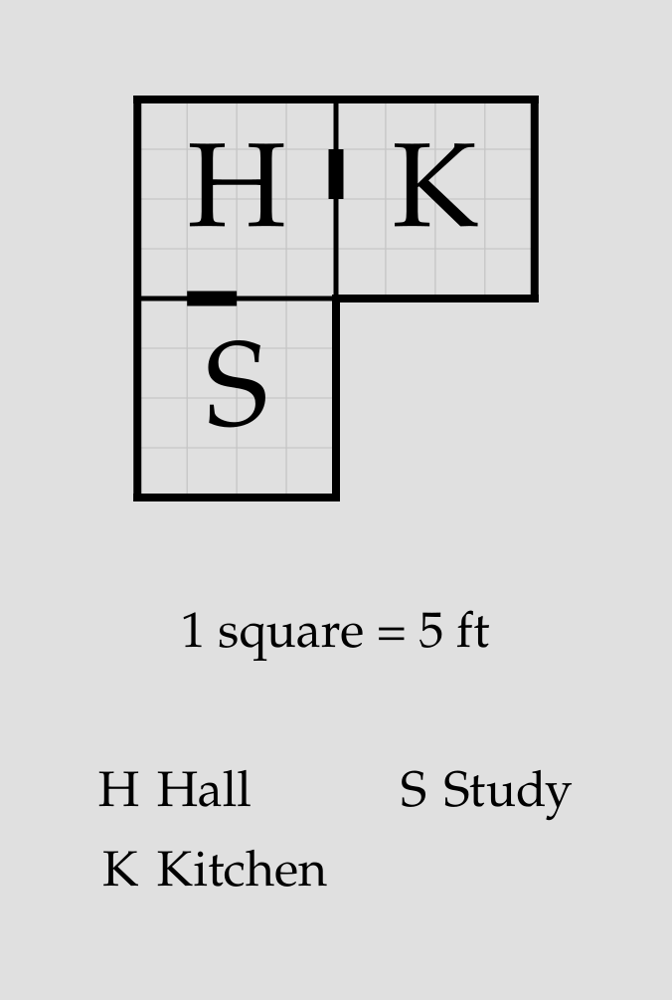
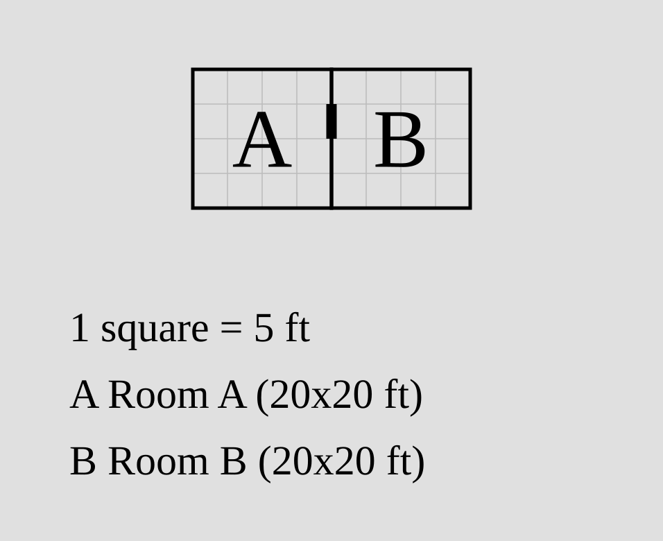
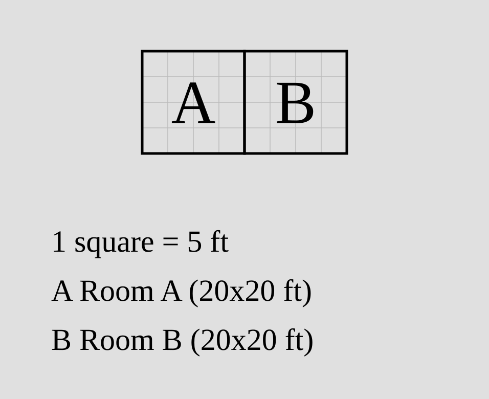
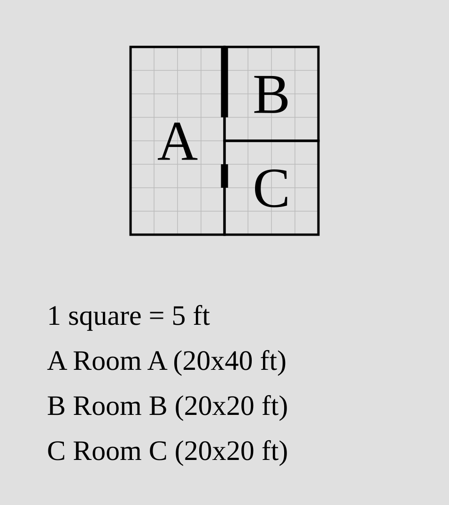
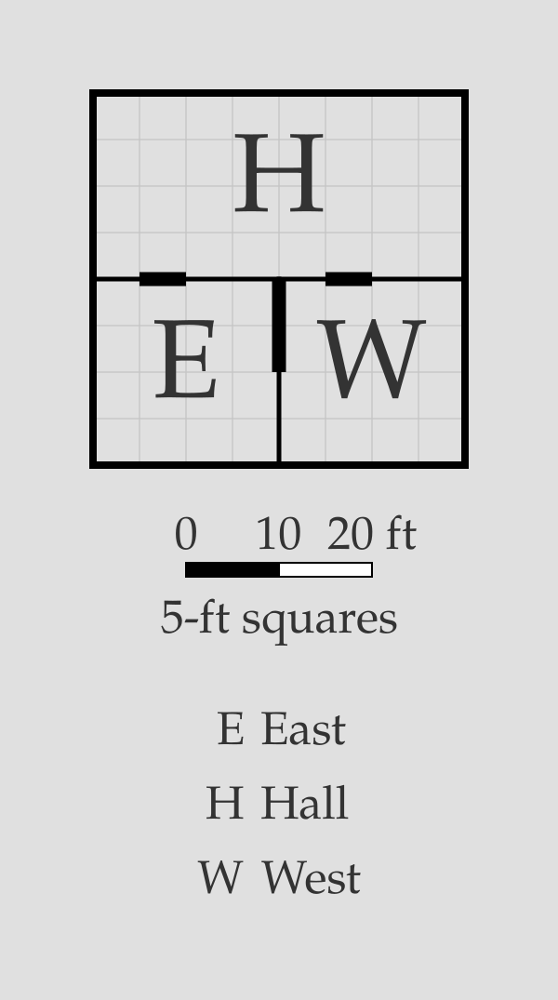
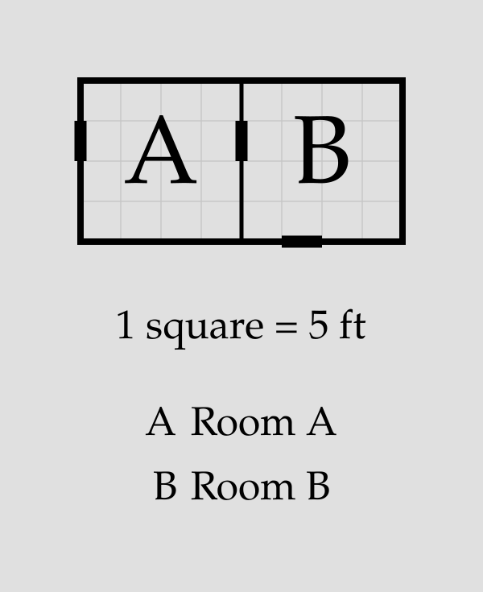
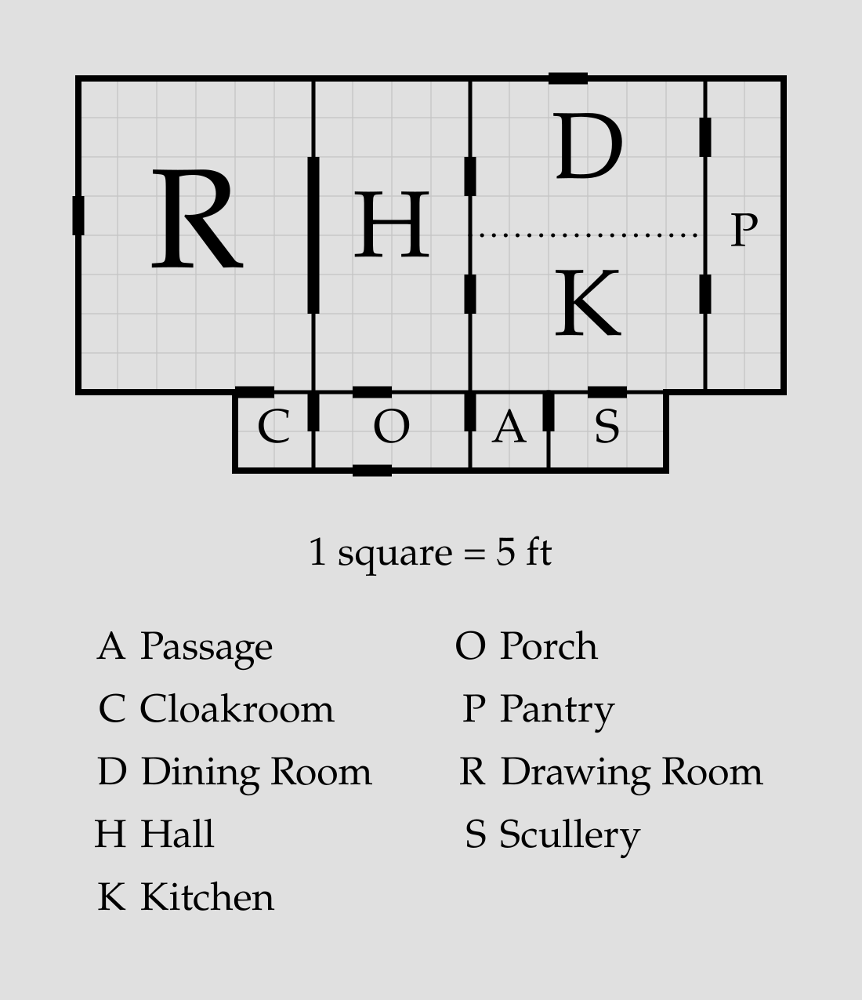

# Doors

A `porta` plan draws a **door** on every wall that two rooms share, so a plan
is connected without any extra work. You write a door directive only to change a
default door — remove it, resize it, move it — or to add one the defaults don't
give you: between two rooms that aren't anchored to each other, or onto the
outside.

```porta img/door-overview.svg
room hall    "Hall"    20x20 root
room kitchen "Kitchen" 20x20 right-of hall
room study   "Study"   20x20 down-of hall
```



The short black marks straddling the walls are the default doors — one on each
shared wall.

> [!NOTE]
> Doors appear only in the rendered SVG. The ASCII debug view
> (`porta draw <plan>.porta --debug-ascii`) shows the room layout without them.

## Default doors

Every [relation](room.md#relations) whose two rooms meet along a real shared
wall gets a single door, 5 feet wide and centred on that wall:

```porta img/door-default.svg
room a "Room A" 20x20 root
room b "Room B" 20x20 right-of a
```



A door needs a real wall — at least 5 feet of shared edge. Rooms that meet only
at a corner get no door (and asking for one there is an [error](#invalid-doors)).

## Door modifiers

A door can be controlled from the [relation](room.md#relations) that creates the
shared wall, by adding a modifier after the anchor.

### Removing a door: `no-door`

`no-door` suppresses the default door on that relation:

```porta img/door-no-door.svg
room a "Room A" 20x20 root
room b "Room B" 20x20 right-of a no-door
```



### Sizing and placing a door: `door=W@O`

`door` overrides the default. Its width and offset can each be set or left to
default:

- `door=W` — set the width to `W` feet (default 5).
- `door@O` — set the offset to `O` feet from the wall's **near end**: the top
  for a vertical wall (`left-of` / `right-of`), the left for a horizontal wall
  (`up-of` / `down-of`). The default offset centres the door.
- `door=W@O` — set both.

`W` and `O` are multiples of 5, with `W` at least 5 and `O` at least 0.

```porta img/door-sized.svg
room a "Room A" 20x40 root
room b "Room B" 20x20 right-of a door=15
room c "Room C" 20x20 right-of a align=end door=5@5
```



`b` gets a wide 15-foot door; `c` a narrow one set 5 feet down from the top of
its wall.

## The door statement

Some doors aren't tied to a positioning relation. A standalone **`door`
statement**, on its own line, adds one.

### Between two rooms: `door <a> <b>`

Two rooms can share a wall without either being the other's anchor — for
instance when both hang off a common neighbour. A `door` statement connects
them:

```porta img/door-standalone.svg
room hall "Hall" 40x20 root
room east "East" 20x20 down-of hall
room west "West" 20x20 down-of hall shift=20
door east west
```



`east` and `west` are both placed below the hall and meet along a wall, but
neither anchors the other, so there's no default door between them — `door east
west` adds it. A door statement takes the same `=W@O` controls as a modifier
(`door=10@5 east west`).

> [!NOTE]
> Two doors may share a wall as long as they don't overlap — a pair of separate
> openings is fine. Two that overlap are an [error](#invalid-doors).

### To the outside: `door <room> outside <side>`

An **external** door opens a room onto the outside, on a named side — `up`,
`down`, `left`, or `right`:

```porta img/door-outside.svg
room a "Room A" 20x20 root
room b "Room B" 20x20 right-of a
door a outside left
door b outside down
```



The side must be genuinely exterior: if another room sits flush against that
stretch of wall, the door is an [error](#invalid-doors) — use a `door <a> <b>`
between the two rooms instead.

## Invalid doors

`porta` rejects a door it can't place:

- An explicit `door` on a relation whose rooms share no wall (they meet only at
  a corner).
- A door wider than its wall, or pushed past the wall's end by its offset.
- Two doors that overlap on the same wall.
- An external door on a side that isn't exterior — a room sits flush there.

## Putting it together

```porta img/door-capstone.svg
room hall     "Hall"          20x40 root
room drawing  "Drawing Room"  30x40 left-of hall door=20
room dining   "Dining Room"   30x20 right-of hall
room kitchen  "Kitchen"       30x20 right-of hall align=end no-door
room pantry   "Pantry"        10x?  right-of dining right-of kitchen
room porch    "Porch"         20x10 down-of hall
room cloak    "Cloakroom"     10x10 down-of drawing left-of porch
room scullery "Scullery"      15x10 down-of kitchen align=end shift=-5
room passage  "Passage"       ?x10  right-of porch left-of scullery
door dining kitchen
door porch outside down
```



The [manor from the rooms guide](room.md#putting-it-together), now with its
doors controlled: a wide opening into the Drawing Room (`door=20`), no direct
door from the hall into the Kitchen (`no-door`), a serving door between the
Dining Room and Kitchen (`door dining kitchen`), and the front door onto the
Porch (`door porch outside down`).
