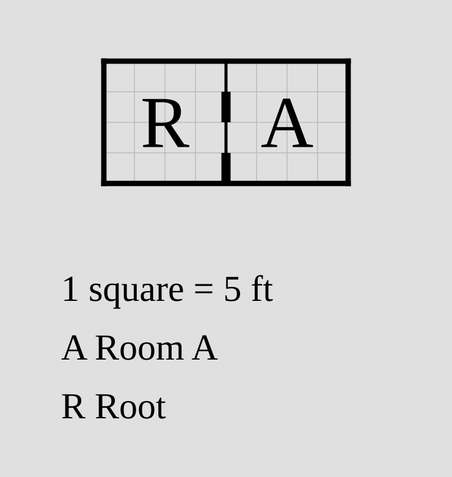
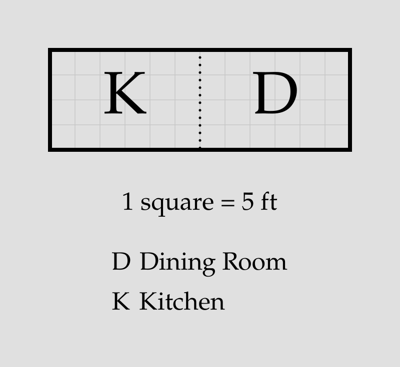
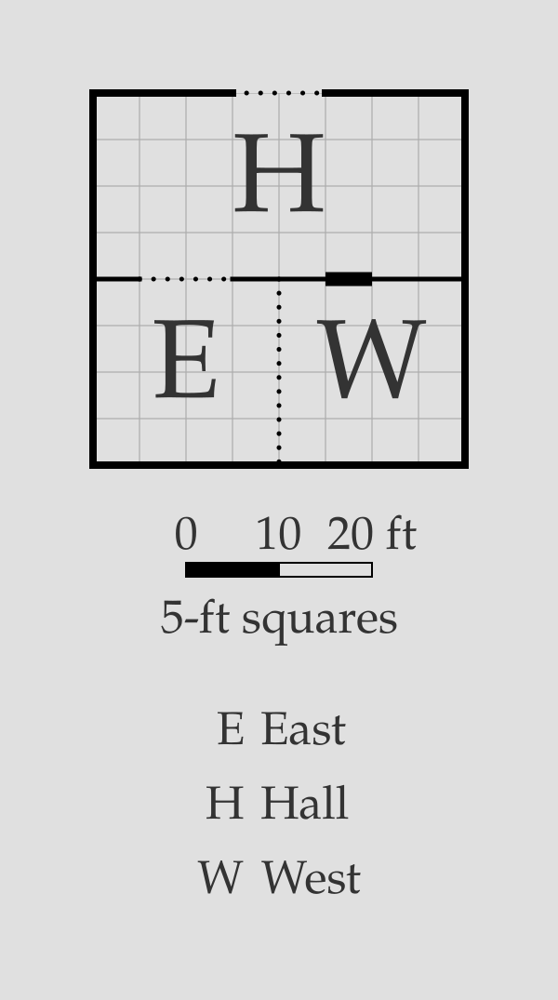

# Doors

By default, `porta` draws a **door** on every wall between a declared
[room](room.md) and its anchor. Explicit [door declarations](#door-declarations)
and [statements](#the-door-statement) are needed only to change a door from
its default settings (remove it, resize it, move it) or to add an additional door
in a non-default location.

> [!NOTE]
> Doors are drawn as thick black marks straddling the walls between
> the rooms they connect. They only appear in rendered SVG; the
> ASCII debug view (`porta draw <plan>.porta --debug-ascii`) 
> shows the room layout without them.

## Default doors

Every [relation](room.md#relations) connecting two rooms is given a
door by default. These default doors are 5 feet wide and positioned
as close to the centre of the wall as possible. If they cannot be placed
fully centrally due to the 5-foot wall grid, they are positioned
immediately above (for vertical walls) or to the left of the center
(for horizontal walls).

```porta img/door-overview.svg
room hall    "Hall"    20x20 root
room kitchen "Kitchen" 20x20 right-of hall
room study   "Study"   20x20 down-of hall
```


An important exception to this behavior is doors within [blocks](block.md).
If two rooms are members of the same block, any default doors between them
will be suppressed along with their adjoining walls.

## Door declarations

The door drawn by a [relation](room.md#relations) can be modified by
a **door declaration** added to the end of that relation. There are two
types of door declaration:

- A `no-door` declaration suppresses the default door on that relation.
- A `door*` declaration changes the **width** and/or **offset** of the
  door: `door=W` sets the door width to `W` feet, `door@O` sets the
  start of the door to `O` feet from the start of the wall, and
  `door=W@O` sets both.

```porta img/door-declarations.svg
room r "Root" 20x20 root
room a "Room A" 20x20 right-of r no-door
room b "Room B" 20x20 down-of r door=10
room c "Room C" 20x20 right-of b door@15
```


## The `door` statement

Some doors aren't tied to a positioning relation. A standalone **`door`
statement**, on its own line, adds one.

### Between two rooms: `door <a> <b>`

Two rooms can share a wall without either being the other's anchor. A
`door` statement connects them, following the same width and offset
syntax as [door declarations](#door-declarations):

```porta img/door-standalone.svg
room hall "Hall" 40x20 root
room east "East" 20x20 down-of hall
room west "West" 20x20 down-of hall shift=20
door=10@0 east west
```


`door` statements can also be used to add additional doors to walls that
already have them, as long as the doors do not overlap:

```porta img/door-multi.svg
room r "Root" 20x20 root
room a "Room A" 20x20 right-of r door@5
door@15 r a
```



### To the outside: `door <room> outside <side>`

An **external** door opens a room onto the outside, on a named side — `up`,
`down`, `left`, or `right`:

```porta img/door-outside.svg
room a "Room A" 20x20 root
room b "Room B" 20x20 right-of a
door a outside left
door b outside down
```


## Open boundaries

Two rooms sometimes form one freely traversable space — a kitchen opening
into a dining area, or adjoining zones of a great hall — while remaining
separately named and numbered. Adding **`open`** immediately after a door
spec turns that door into an open boundary: the wall is omitted across the
door's span and a dotted line marks where one room ends and the other
begins, with no door drawn.

```porta img/door-open.svg
room kitchen "Kitchen" 30x20 root
room dining  "Dining Room" 30x20 right-of kitchen door=20 open
```



An open door is placed exactly like a solid one: the same width and offset
syntax, the same 5-ft default width, and the same fit and overlap rules
(so a narrow opening — an archway — can share a wall with an ordinary
door). The `open` marker works in every position a door spec can appear:

```porta img/door-open-forms.svg
room hall "Hall" 40x20 root
room east "East" 20x20 down-of hall door=10 open
room west "West" 20x20 down-of hall shift=20
door=20@0 open east west
door=10 open hall outside up
```



Open doors interact with [blocks](block.md) the way solid doors do: between
two members of the same block the opening is suppressed with a warning (the
shared wall is already gone), while an open door between a member and a room
outside the block cuts a gap into the block's outline.

## Invalid doors

`porta` rejects a door it can't place:

- An explicit `door` on a relation whose rooms share no wall (they meet only at
  a corner).
- A door wider than its wall, or pushed past the wall's end by its offset.
- Two doors that overlap on the same wall.
- An external door on a side that isn't exterior — a room sits flush there.
- An `open` marker that doesn't immediately follow a door spec, or an open
  door combined with `no-door` on the same relation.

## Putting it together

```porta img/door-capstone.svg
room hall     "Hall"          20x40 root
room drawing  "Drawing Room"  30x40 left-of hall door=20
room dining   "Dining Room"   30x20 right-of hall door@10
room kitchen  "Kitchen"       30x20 right-of hall align=end
room pantry   "Pantry"        10x?  right-of dining right-of kitchen
room porch    "Porch"         20x10 down-of hall
room cloak    "Cloakroom"     10x10 down-of drawing left-of porch
room scullery "Scullery"      15x10 down-of kitchen align=end shift=-5
room passage  "Passage"       ?x10  right-of porch left-of scullery
door=10@5 dining kitchen
door porch outside down
door dining outside up
door drawing outside left
```


