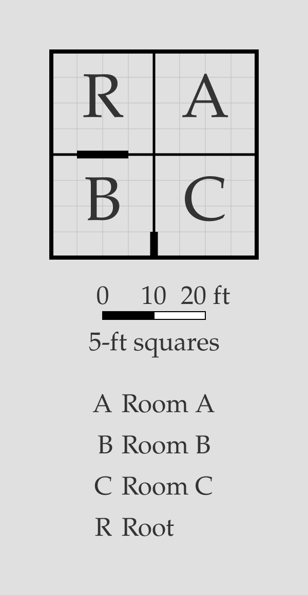

# Doors

By default, `porta` draws a **door* on every wall between a declared
[room](room.md) and its anchor. Explicit [door declarations](...) and
[statements](...) are needed only to change a door from its default
settings (remove it, resize it, move it) or to add an additional door
in a non-default location.

> [!NOTE]
> Doors are draws as thick black marks straddling the walls between
> the rooms they connect. They only appear in rendered SVG; the
> ASCII debug view (`porta draw <plan>.porta --debug-ascii`) 
> shows the room layout without them.

## Default doors

Every [relation](room.md#relations) connecting two rooms is given a
door by default. These default doors are 5 feet wide and positioned
as close to the centre of the wall as possible. If they cannot be placed
fully centrally due to the 5-foot wall grid, they are positioned
immediately above (for vertical walls) or to the left of the center
(for horizontal walls).

```porta img/door-overview.svg
room hall    "Hall"    20x20 root
room kitchen "Kitchen" 20x20 right-of hall
room study   "Study"   20x20 down-of hall
```


## Door declarations

The door drawn by a [relation](room.md#relations) can be modified by
a **door declaration** added to the end of that relation. There are two
types of door declaration:

- A `no-door` declaration suppresses the default door on that relation.
- A `door*` declaration changes the **width** and/or **offset** of the
  door: `door=W` sets the door width to `W` feet, `door@O` sets the
  start of the door to `O` feet from the start of the wall, and
  `door=W@O` sets both.

```porta img/door-declarations.svg
room r "Root" 20x20 root
room a "Room A" 20x20 right-of r no-door
room b "Room B" 20x20 down-of r door=10
room c "Room C" 20x20 right-of b door@15
```



## The door statement

Some doors aren't tied to a positioning relation. A standalone **`door`
statement**, on its own line, adds one.

### Between two rooms: `door <a> <b>`

Two rooms can share a wall without either being the other's anchor — for
instance when both hang off a common neighbour. A `door` statement connects
them:

```porta img/door-standalone.svg
room hall "Hall" 40x20 root
room east "East" 20x20 down-of hall
room west "West" 20x20 down-of hall shift=20
door east west
```


`east` and `west` are both placed below the hall and meet along a wall, but
neither anchors the other, so there's no default door between them — `door east
west` adds it. A door statement takes the same `=W@O` controls as a modifier
(`door=10@5 east west`).

> [!NOTE]
> Two doors may share a wall as long as they don't overlap — a pair of separate
> openings is fine. Two that overlap are an [error](#invalid-doors).

### To the outside: `door <room> outside <side>`

An **external** door opens a room onto the outside, on a named side — `up`,
`down`, `left`, or `right`:

```porta img/door-outside.svg
room a "Room A" 20x20 root
room b "Room B" 20x20 right-of a
door a outside left
door b outside down
```


The side must be genuinely exterior: if another room sits flush against that
stretch of wall, the door is an [error](#invalid-doors) — use a `door <a> <b>`
between the two rooms instead.

## Invalid doors

`porta` rejects a door it can't place:

- An explicit `door` on a relation whose rooms share no wall (they meet only at
  a corner).
- A door wider than its wall, or pushed past the wall's end by its offset.
- Two doors that overlap on the same wall.
- An external door on a side that isn't exterior — a room sits flush there.

## Putting it together

```porta img/door-capstone.svg
room hall     "Hall"          20x40 root
room drawing  "Drawing Room"  30x40 left-of hall door=20
room dining   "Dining Room"   30x20 right-of hall
room kitchen  "Kitchen"       30x20 right-of hall align=end no-door
room pantry   "Pantry"        10x?  right-of dining right-of kitchen
room porch    "Porch"         20x10 down-of hall
room cloak    "Cloakroom"     10x10 down-of drawing left-of porch
room scullery "Scullery"      15x10 down-of kitchen align=end shift=-5
room passage  "Passage"       ?x10  right-of porch left-of scullery
door dining kitchen
door porch outside down
```


The [manor from the rooms guide](room.md#putting-it-together), now with its
doors controlled: a wide opening into the Drawing Room (`door=20`), no direct
door from the hall into the Kitchen (`no-door`), a serving door between the
Dining Room and Kitchen (`door dining kitchen`), and the front door onto the
Porch (`door porch outside down`).
