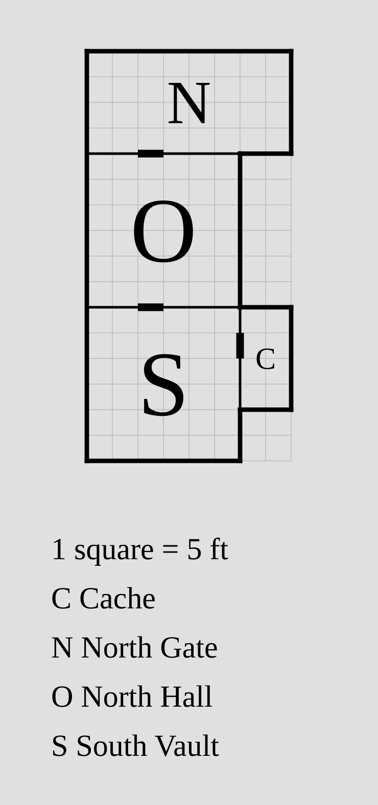
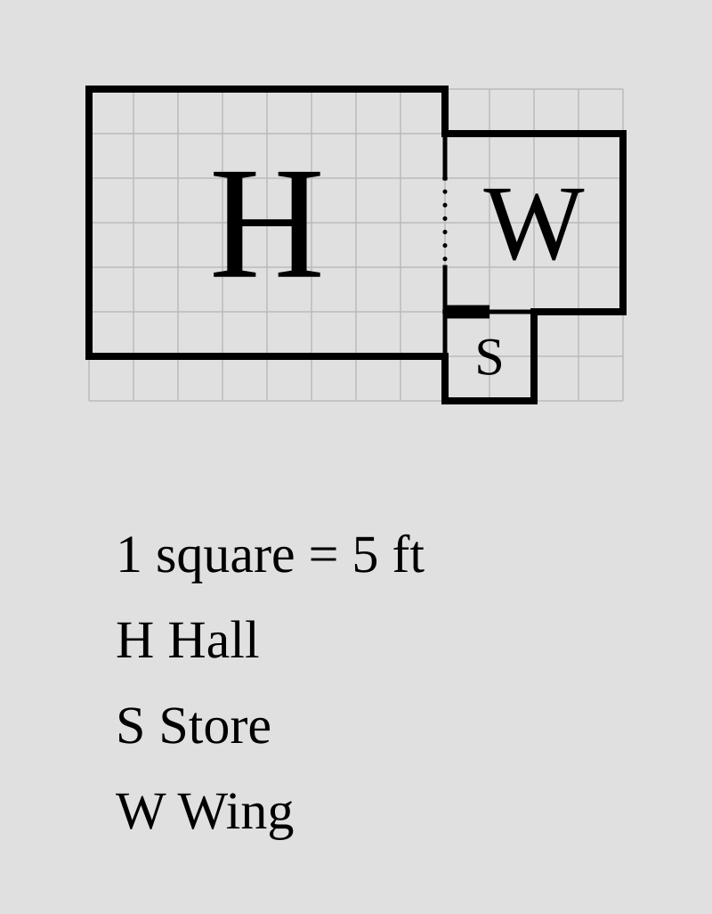
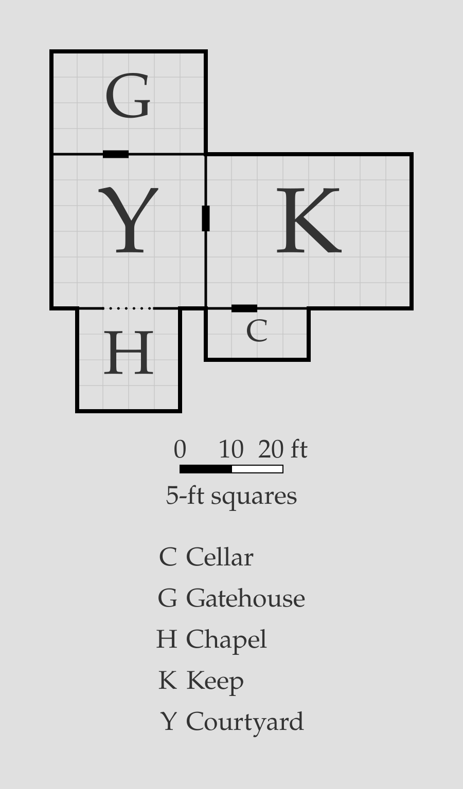

# Links

A **link** joins two [disconnected components](room.md#disconnected-components)
into one continuous floorplan, through a relation between one room from each
component:

```porta img/link.svg
room north-gate "North Gate" 40x20 root
room north-hall "North Hall" 30x30 down-of north-gate
room south-vault "South Vault" 30x30 root
room cache "Cache" 10x20 right-of south-vault
link south-vault down-of north-hall
```



This supports iterative transcription of an existing map: model separate
regions first, each rooted independently, then join them approximately with
links — and replace those links with real connecting rooms once the
intervening geometry is understood.

## The `link` statement

```
link <room-a> <relation> <room-b> [align=...] [shift=...] [door...] [no-door]
relation = up-of | down-of | left-of | right-of
```

A link reads exactly like a [relation](room.md#relations) between `<room-a>`
and `<room-b>`, which must belong to different components. `<room-a>`'s whole
component is translated so that `<room-a>` sits flush in the given direction
of `<room-b>`, precisely where the equivalent relation would place it:

- The usual [5-foot shared-wall minimum](room.md#adjacency) applies to the
  two named rooms.
- [`align=`](room.md#alignment) and [`shift=`](room.md#shifting) act on the
  free axis, as on a relation.
- Only the component's translation changes: every room in it keeps its
  internal geometry, relations, and root.

## Doors on links

The linked wall behaves like any relation's shared wall: it takes a default
5-foot door, and the full range of
[door declarations](door.md#door-declarations) — `door=W@O`, `no-door`,
`open`, `secret` — is available on the link:

```porta img/link-door.svg
room hall "Hall" 40x30 root
room wing "Wing" 20x20 root
room store "Store" 10x10 down-of wing
link wing right-of hall align=end shift=-5 door=10@5 open
```



Once linked flush, rooms from the two components are genuinely adjacent, so
standalone [`door` statements](door.md#the-door-statement) across the seam
work too.

## Multiple links

Each link fixes where its two components sit relative to one another, so
links may chain any number of components, and several links may constrain the
same components as long as they agree — a pair of links stating the same
join from both ends is fine (though each carries its own default door, so
one of the pair needs `no-door`). Links that disagree about where a
component belongs are an error. Components not reached by any link are
still [packed automatically](room.md#disconnected-components) alongside the
linked group.

## Retiring a link

Linked components remain separate components, each with its own root. That
makes a link easy to retire: when you replace it with real connecting
geometry, the two parts become one component — and one component allows only
one root — so the link and one of the roots are removed together.

## Invalid links

`porta` rejects a link it can't apply:

- A named room that doesn't exist.
- Two rooms that are already in the same component.
- Links that contradict each other about a component's position.
- A join that leaves the named rooms sharing less than 5 feet of wall.
- A join that makes any two rooms overlap.

## Putting it together

```porta img/link-capstone.svg
room gate "Gatehouse" 30x20 root
room yard "Courtyard" 30x30 down-of gate
room keep "Keep" 40x30 root
room cellar "Cellar" 20x10 down-of keep
room chapel "Chapel" 20x20 root
link keep right-of yard align=end
link chapel down-of yard shift=5 door=10 open
```


