# Rooms

The core of a `porta` plan is a list of [rooms](#the-room-statement), linked by 
[relations](#relations) into a floorplan. With the exception of
the [root](#the-root), each room is positioned relative to one or more
**anchors** defined previously in the plan. `porta`
[resolves rooms](#how-positions-are-resolved) outward from the root until
every room is placed.

```porta img/overview.svg
room hall    "Hall"    30x20 root
room parlour "Parlour" 20x20 left-of hall
room kitchen "Kitchen" 20x20 right-of hall
```

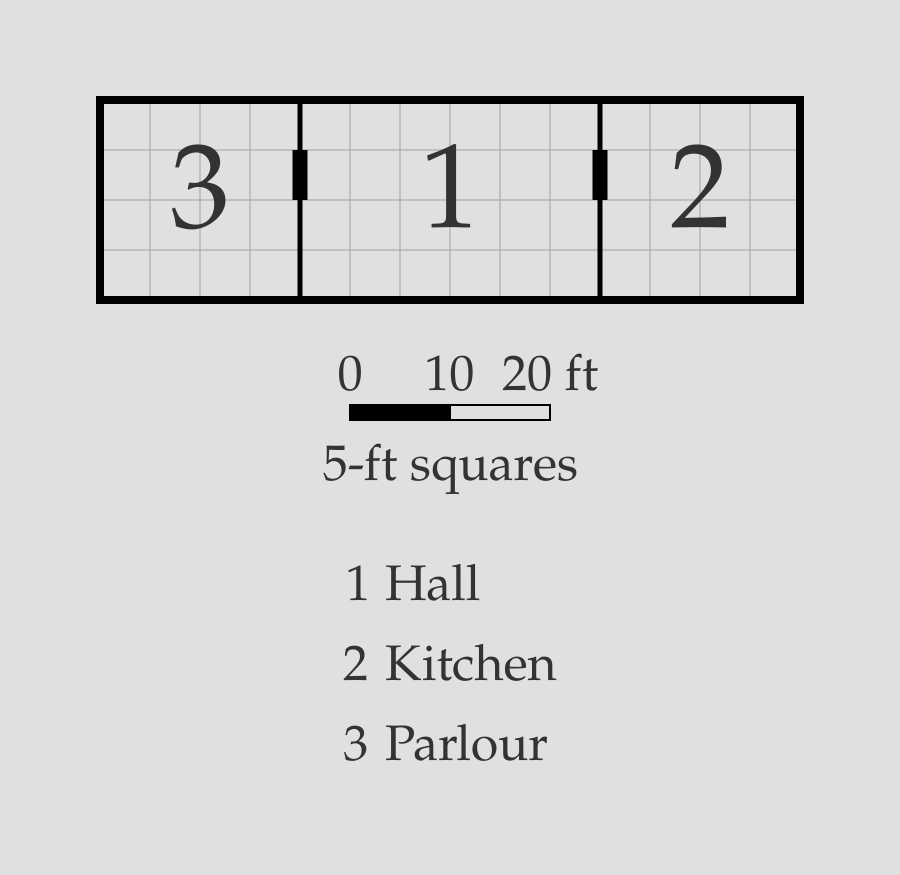

> [!NOTE]
> The short black marks on the shared walls are **doors**, which are
> added by default between adjoining rooms. Door syntax is described
> separately [here](door.md).

> [!WARNING]
> At the time of writing, **only rectangular rooms are supported** in
> `porta`. Non-rectangular rooms are planned for a future release.

## The `room` statement

A room is declared in a `porta` plan as follows:

```text
room <id> "<name>" <dimensions> <relations>
```

Each `room` statement consists of the following components in order:

1. A literal `room` keyword;
2. A [room ID](#room-id) used to point to that room elsewhere in the plan;
3. A [room name](#room-name) shown in the rendered map key;
4. A [dimension declaration](#dimensions) of the form `WxH`;
5. One or more [relations](#relations).

### Room ID

A room ID is the handle other parts of the `porta` plan use to refer to that
room. It never appears in the rendered map. An ID must match
`[a-z][a-z0-9_-]*`: a lowercase letter to start, followed by any number of
lowercase letters, digits, hyphens, or underscores. Each ID must be unique
within a plan, and can't match any of `porta`'s reserved keywords.

> [!WARNING]
> At the time of writing, the following keywords are **reserved** in `porta`
> plans and cannot be used for room IDs:
> `root`, `door`, `no-door`, `outside`, `shift`, `align`, `up-of`, `down-of`,
> `left-of`, `right-of`

> [!NOTE]
> Examples of valid IDs in `porta`: ...
> Examples of invalid IDs: ...

### Room name

A room name is the label given to that room in the rendered map generated
from a `porta` plan. A valid name must meet the following criteria:

- A single double-quoted string 1-40 characters long;
- Contains no double-quotes (literal `"`) internally;
- Contains only printable Unicode characters (no control characters);
- Starts and ends with non-whitespace printable characters;
- Fits on a single line – no linebreaks.

Names are interpreted literally, without escapes. All printable Unicode
is valid within a name, subject to the restrictions above.

### Dimensions

The dimensions of a room statement defines that room's width and height
in feet. A dimension declaration takes the form `WxH`, where `W` and `H`
indicate width and height respectively. Each of `W` and `H` must either:

1. Be an integer positive multiple of 5 (`5`, `10`, `15`, etc.); or
2. Be `?`, prompting `porta` to set that dimension [automatically](#auto-dimensions)
if possible.

> [!NOTE]
> Examples of valid dimension declarations: `30x40`, `10x?`, `?x50`, `?x?`

### Relations

A room's relations define its positioning relative to other rooms in
a `porta` plan. Each relation begins with a **relation keyword**, 
followed by zero or more **arguments**. Valid relation keywords are
`root` (which takes no arguments) and the four **direction keywords**:
`up-of`, `right-of`, `left-of` and `down-of`.

Each direction keyword takes a [room ID](#room-id) as its first 
argument, indicating the **anchor room** relative to which the 
new room must be positioned; subsequent arguments can refine the
relative positioning of the new room versus its anchor.

For more on relation syntax, see [below](#positioning-rooms).

## Positioning rooms

### The root

Every `porta` plan must have exactly one `root` room, defining the
fixed point against which all other rooms are measured. Plans with
zero roots, or more than one, are invalid. `porta` puts
the top-left corner of the root room at the origin of its coordinate
system and grows the plan outward from there.

```porta img/root.svg
room root_room "Root room" 40x30 root
```

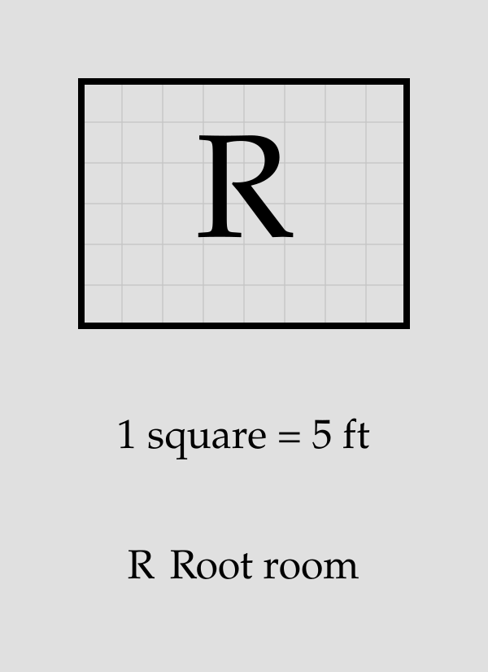

### Adjacency

A spatial relation places a room flush against its anchor in the
specified direction:

```porta img/adjacency.svg
room root_room "Root room" 10x10 root
room left_room "Left room" 15x10 left-of root_room
room right_room "Right room" 15x10 right-of root_room
room up_room "Up room" 10x15 up-of root_room
room down_room "Down room" 10x15 down-of root_room
```

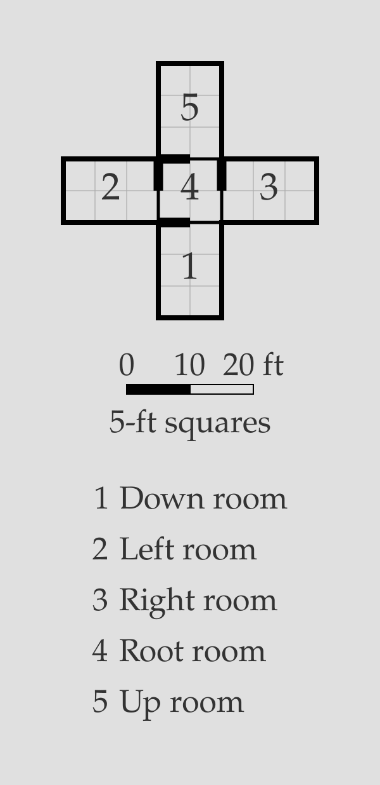

Each adjacency declaration pins one end of one axis; the room's dimension
declaration sets the other. `up-of` and `down-of` pin the room's vertical
position; `left-of` and `right-of` pin its horizontal position. The axis
pinned by a relation is the **pinned axis**; the other is the **free axis**.

A room can have multiple adjacency relations. The simplest case is to pin
the room on both axes, leaving no free axis at all:

```porta img/corner.svg
room root_room "Root room" 10x10 root
room right_room "Right room" 15x10 right-of root_room
room down_room "Down room" 10x15 down-of root_room
room corner_room "Corner room" 10x10 right-of down_room down-of right_room
```

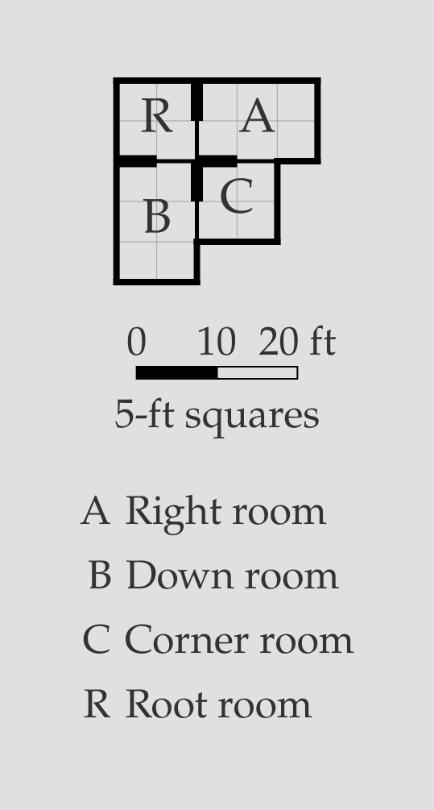

A room can also be pinned on either side of the same axis:

```porta img/flank.svg
room root_room "Root room" 10x10 root
room left_room "Left room" 10x15 left-of root_room
room right_room "Right room" 10x15 right-of root_room
room left_down_room "Left-down room" 10x10 down-of left_room
room right_down_room "Right-down room" 10x10 down-of right_room
room flanked "Flanked room" 10x10 right-of left_down_room left-of right_down_room
```


Finally, a room can be pinned to multiple rooms on the same side:

```porta img/span.svg
room root_room "Root room" 10x10 root
room down_room "Down room" 10x10 down-of root_room
room span_room "Span room" 10x20 right-of root_room right-of down_room
```

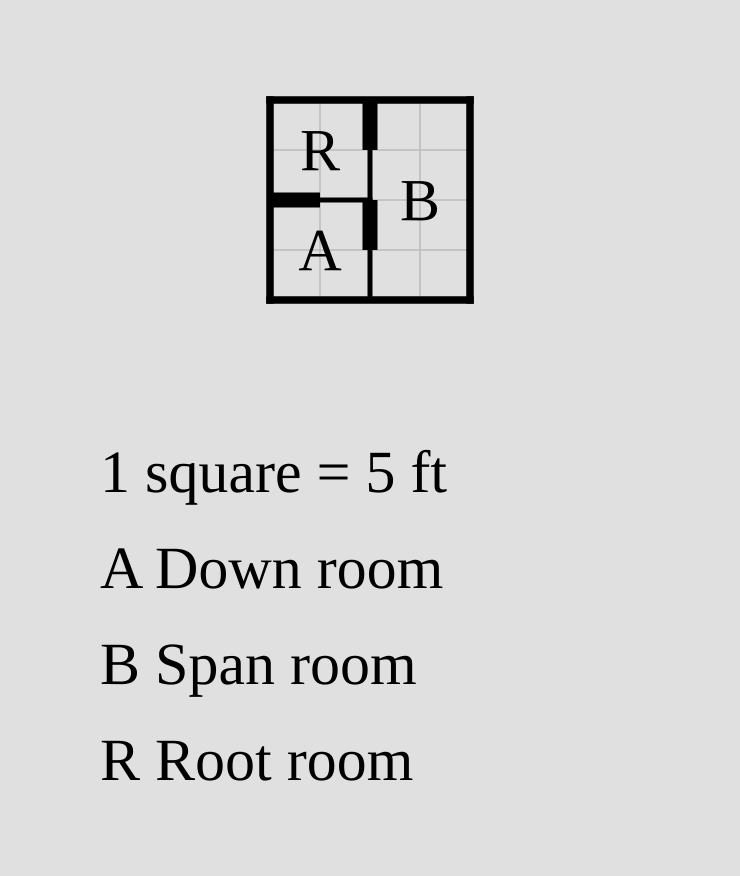

In all cases, **a room must share at least 5 feet of wall with all of its anchors**.
If a room statement declares an anchor, but the dimensions of the room do not allow
it to sit flush with that room while meeting its other constraints, the plan is
invalid.

### Alignment

By default, a room is anchored to the start of the corresponding edge of its
anchor room: top for vertical edges, left for horizontal edges.

```porta img/align_default.svg
room root_room "Root room" 20x20 root
room left_room "Left room" 10x10 left-of root_room
room right_room "Right room" 10x10 right-of root_room
```


> [!NOTE]
> `porta` follows the same coordinate system as the SVG standard, so vertical
> position is measured from the top of the page, not the bottom.

Rooms can instead be aligned to the *end* of their anchor edges by adding an
`align=end` argument to the relevant relation.

```porta img/align_end.svg
room root_room "Root room" 20x20 root
room left_room "Left room" 10x10 left-of root_room align=end
room right_room "Right room" 10x10 right-of root_room align=end
```

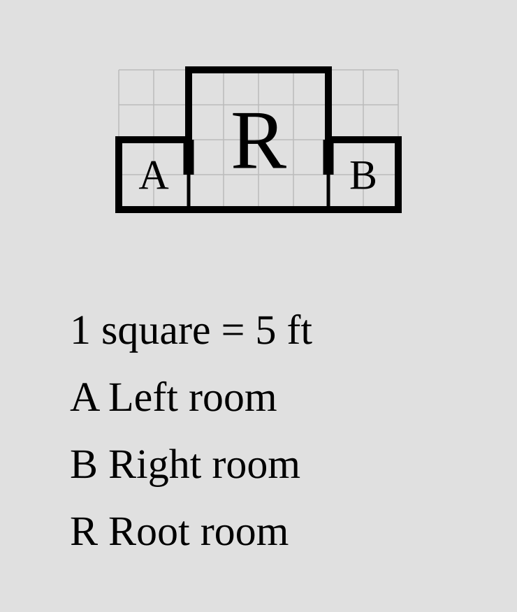

If desired, a start-aligned anchor can be declared explicitly with an
`align=start` argument; this produces the same result as the default.

```porta img/align_start.svg
room root_room "Root room" 20x20 root
room left_room "Left room" 10x10 left-of root_room align=start
room right_room "Right room" 10x10 right-of root_room align=start
```

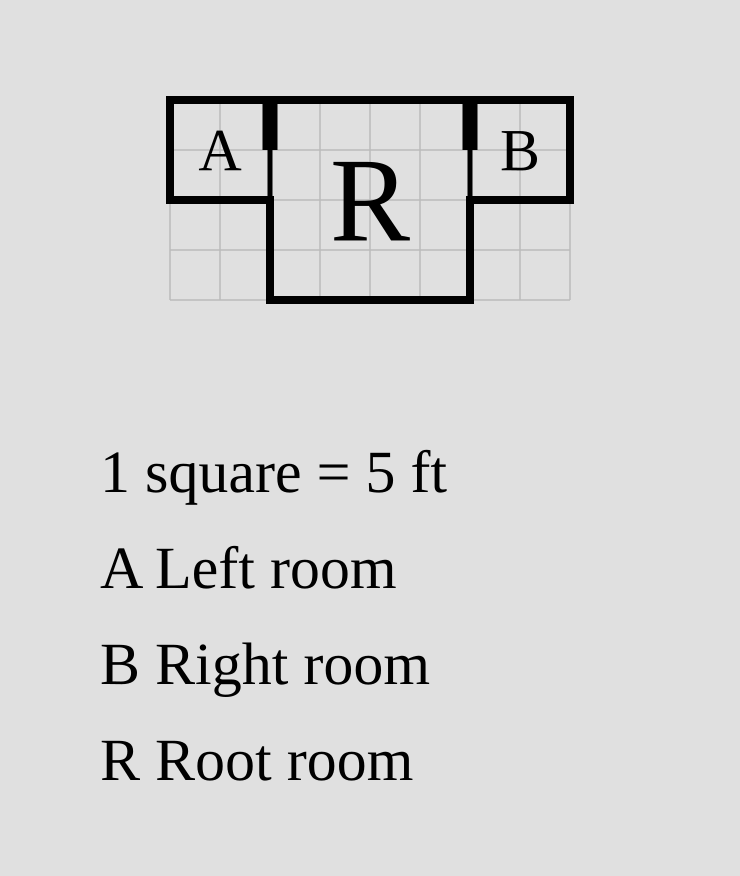

These arguments can be used in multi-relation room statements:

```porta img/flank_align.svg
room root_room "Root room" 10x10 root
room left_room "Left room" 10x25 left-of root_room
room right_room "Right room" 10x25 right-of root_room
room flanked "Flanked room" 10x10 right-of left_room align=end left-of right_room
```

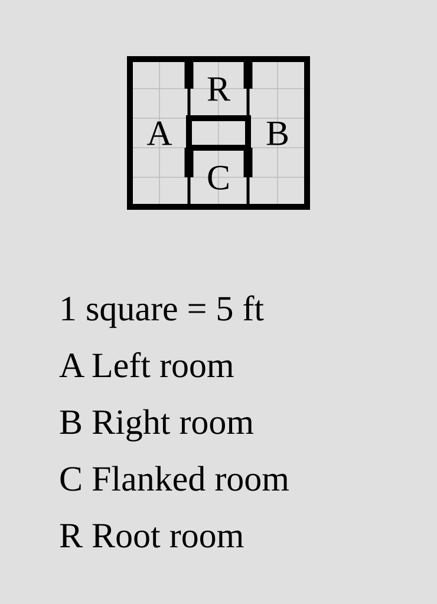

For alignment to have an effect, the room to be aligned must have a free axis
along which its position can be modified. If both axes of a room are pinned,
alignment arguments will raise errors.

### Shifting

Like alignment, shifting modifies the position of a room along its free axis.
Applying a `shift=N` argument to a relation nudges the room `N` feet in the
positive direction (right/down); `shift=-N` nudges it `N` feet in the
negative direction (left/up). Shifting is applied **after alignment**.

```porta img/shift.svg
room root_room "Root room" 20x20 root
room right_room "Right room" 10x10 right-of root_room shift=5
room left_room "Left room" 10x10 left-of root_room shift=-5
room down_room "Down room" 10x10 down-of root_room align=end shift=-5
room up_room "Up room" 10x10 up-of root_room align=end shift=5
room outer_room "Outer room" 10x10 right-of right_room shift=-5
```

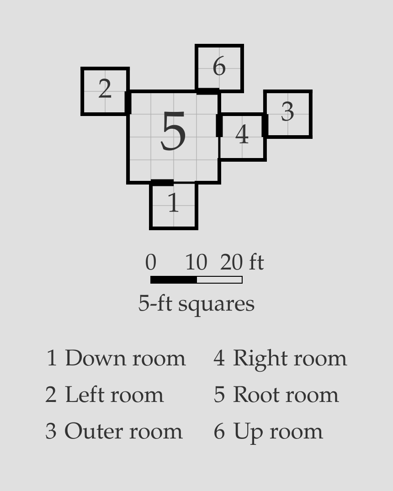

As always, a room must share at least 5 feet of wall with each of its anchors
after shifting. Shifting a room fully off of its anchor produces an
invalid plan.

## Auto dimensions (`?`)

A dimension of `?` in a room statement instructs `porta` to derive that dimension
from the room's anchors. In the simplest case, the auto-derived dimension
simply matches the corresponding dimension of the anchor:

```porta img/auto-single.svg
room root_room "Root room" 20x20 root
room right_room "Right room" 20x? right-of root_room
room down_room "Down room" ?x20 down-of root_room
room corner_room "Corner room" ?x? right-of down_room down-of right_room
```

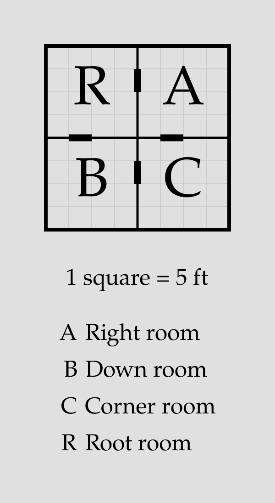

If a room is shifted, `?` will extend it to the end of the anchor wall:

```porta img/auto-shift.svg
room root_room "Root room" 20x20 root
room right_room "Right room" 20x? right-of root_room shift=5
room down_room "Down room" ?x20 down-of root_room shift=-5
```

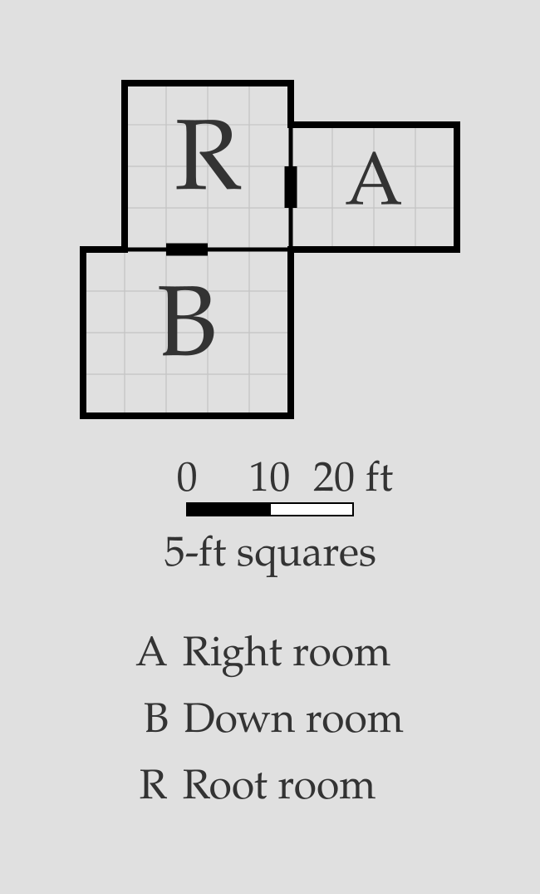

If extension is blocked by another room, `?` will extend the new room up to the barrier, then stop:

```porta img/auto-block.svg
room root_room "Root room" 20x20 root
room right_room "Right room" 20x? right-of root_room
room corner_room "Corner room" 20x20 down-of right_room shift=-5
room down_room "Down room" ?x? down-of root_room left-of corner_room
```

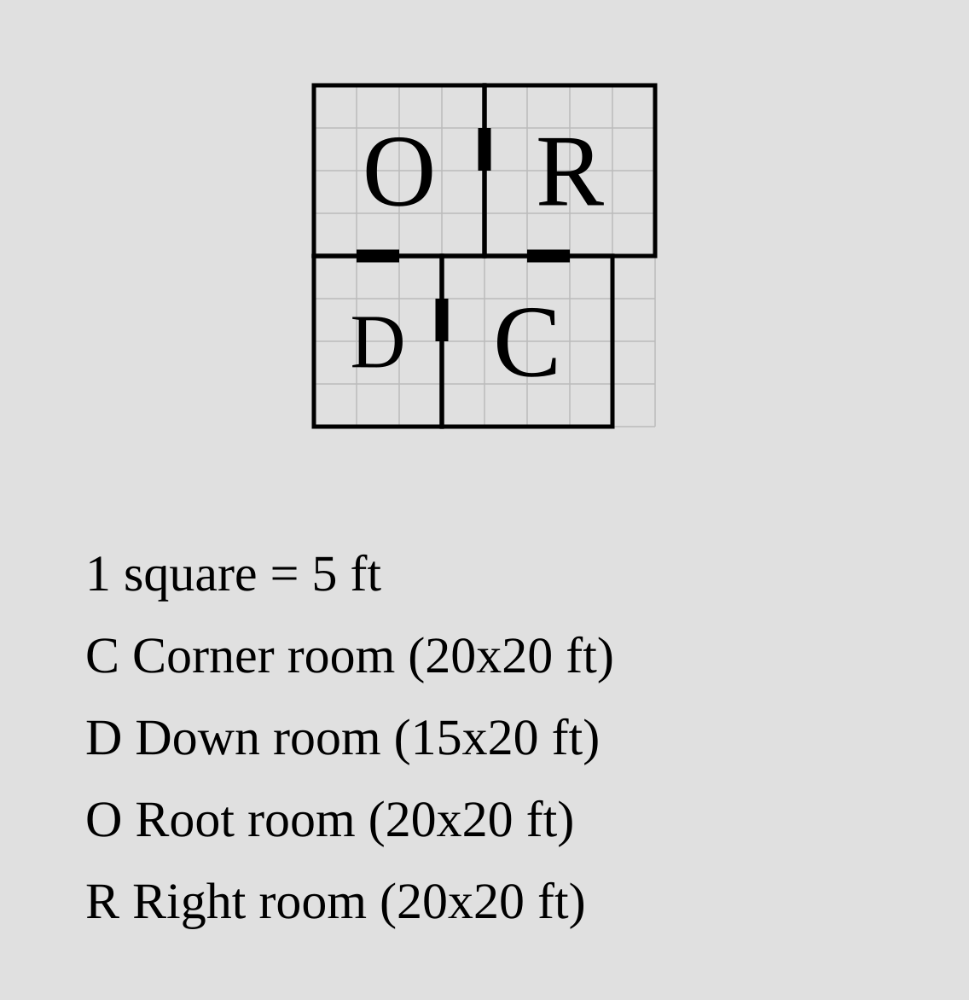

Special behavior is needed when a room has two anchors on the same axis. If these are on 
opposite sides, `?` will extend the new room to snugly fit between them:

```porta img/auto-flank.svg
room root_room "Root room" 10x10 root
room left_room "Left room" 10x15 left-of root_room
room right_room "Right room" 10x15 right-of root_room
room left_down_room "Left-down room" ?x10 down-of left_room
room right_down_room "Right-down room" ?x10 down-of right_room
room flanked "Flanked room" ?x? right-of left_down_room left-of right_down_room
```

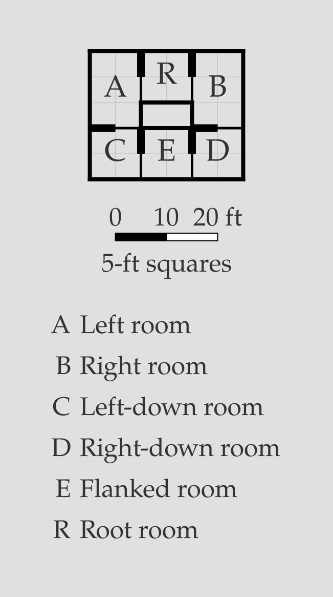

If there are two anchors on the same side, `?` will extend the new room to cover both:

```porta img/auto-union.svg
room a "Root room" 20x10 root
room b "Down room" 20x20 down-of a
room c "Span room" 10x? left-of a left-of b
```

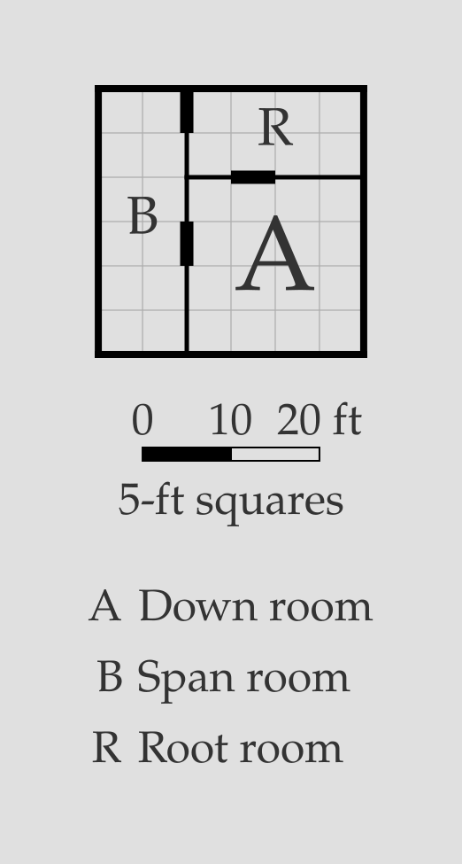

In all cases, a `?` needs something to measure against. `porta` will reject
auto dimensions when there is no wall to size from.

## Resolution

In `porta`, rooms are placed into the coordinate system by building and
traversing a dependency graph. The root is placed at the origin, rooms
anchored to the root are placed in relation to it, rooms anchored to
*those* rooms are placed, and so on until no rooms are left. Cycles,
disconnected components, and irresolvable placements raise errors as
invalid plans. Because of this directed acyclic structure, the whole
plan can be resolved in a single pass, and no constraint solver is needed.

The coordinate system is measured in feet, with the `x`-axis increasing
to the right and the `y`-axis increasing downward. The top-left corner
of the root is placed at `(0,0)`; rooms above or to the left of the root
have negative coordinates. Each room is defined by the coordinates of its
top-left corner plus its dimensions.

Auto-dimensions (`?`) are resolved just before each room is placed, at which
point the position and dimensions of its anchors are already known. As a
result, a `?` dimension can be anchored relative to another `?` dimension,
as long as the chain eventually resolves to an explicit value.

## Invalid plans

The DAG-traversal approach adopted by `porta` requires each room to be fully
defined at the time of its placement, and for each room to share at least
5 feet of wall with each of its anchors. The following are all invalid
under this schema and will raise errors:

- 0 or multiple roots
- Non-existent anchors
- Cyclic room dependencies
- Disconnected rooms
- Overlaps between rooms
- Gaps between a room and its anchor
- Unsolvable `?` dimensions

## Putting it together

```porta img/capstone.svg
room hall    "Hall"    40x30 root
room parlour "Parlour" 20x30 left-of hall
room kitchen "Kitchen" 20x30 right-of hall
room porch   "Porch"   20x10 down-of hall align=end
room cellar  "Cellar"  ?x20  down-of parlour
```

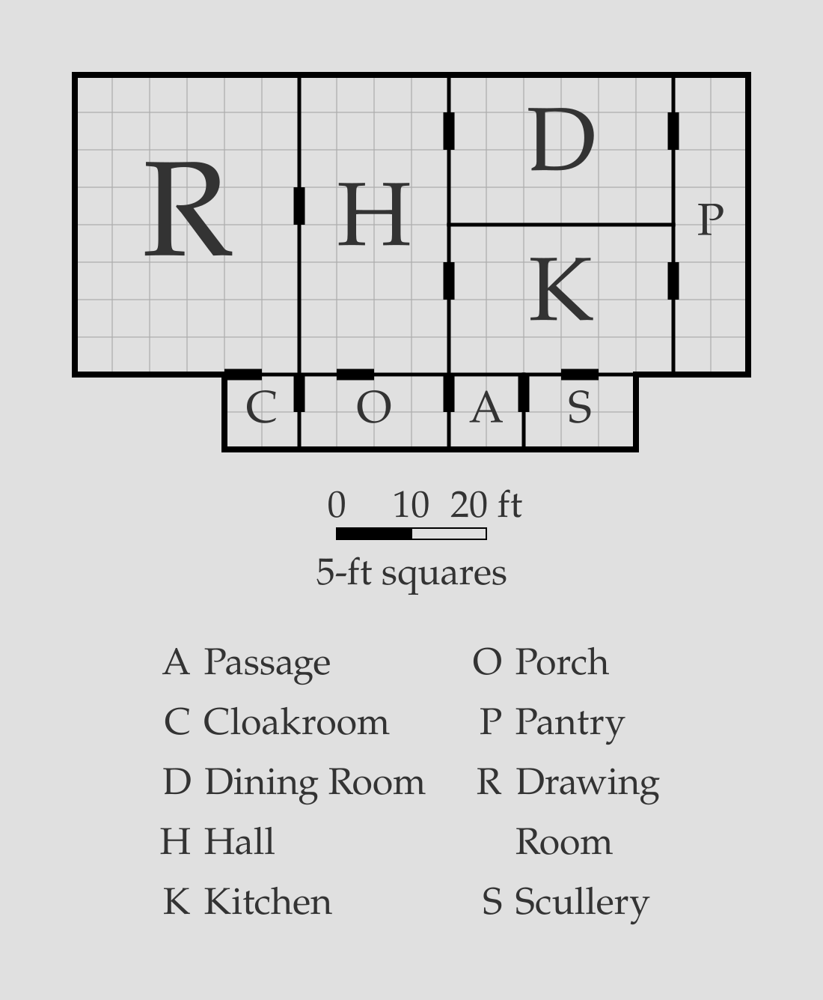

A hall with two wings, a porch tucked under its east end with `align=end`, and a
cellar that takes the parlour's width with `?`. For a larger plan — once you've
met [doors](door.md) — see [`examples/manor.porta`](../examples/manor.porta).
