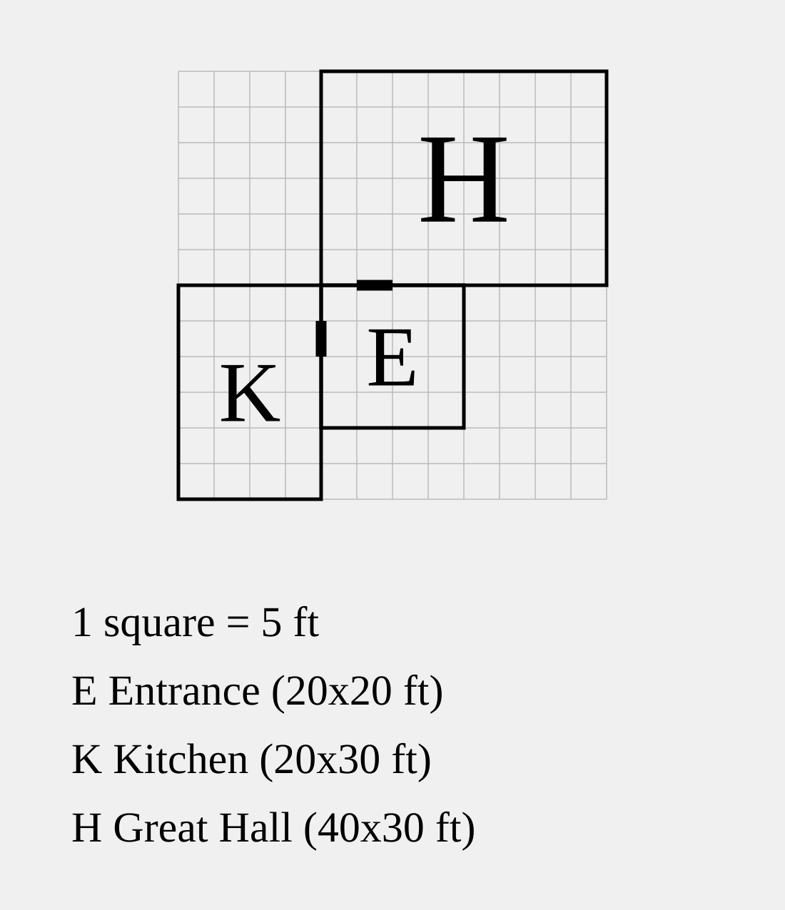
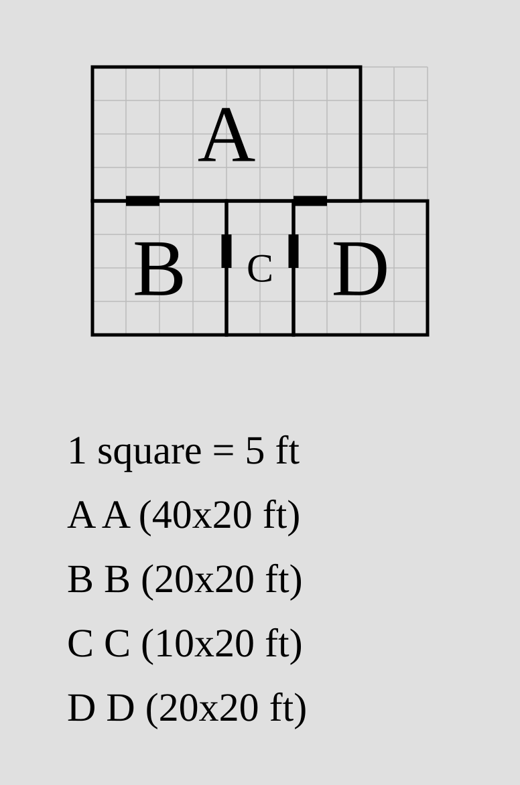
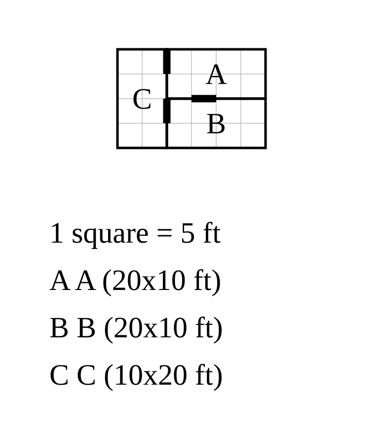
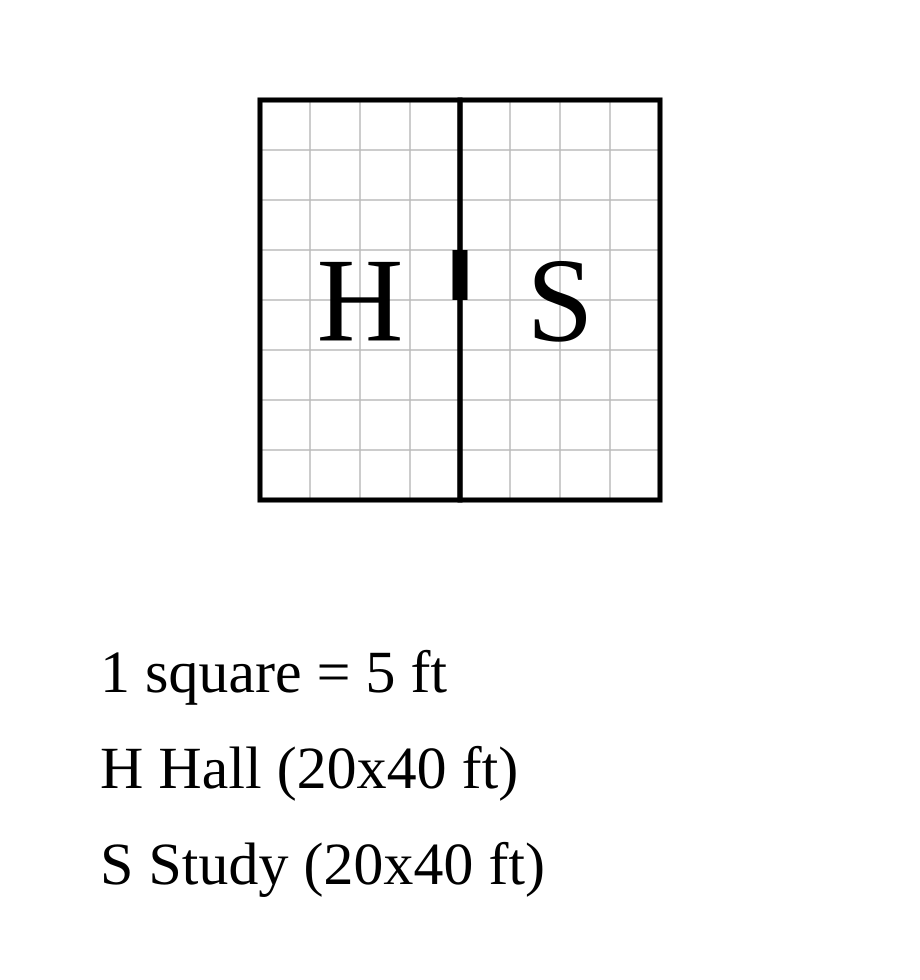
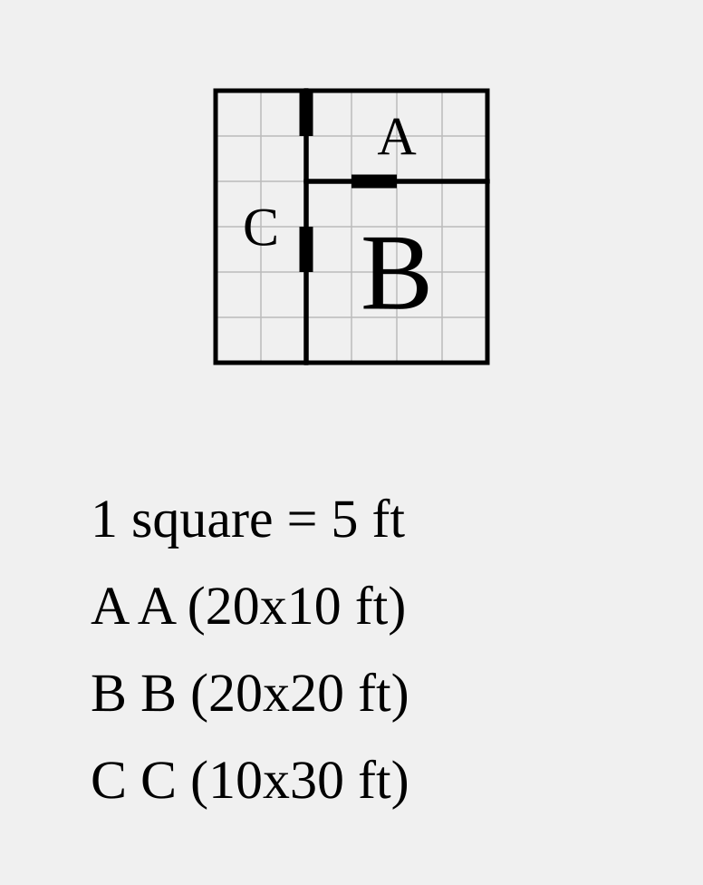

# Rooms

The core of a `porta` plan is a list of [rooms](#the-room-statement), linked by 
[relations](#relations) into a floorplan. With the exception of
the [root](#the-root), each room is positioned relative to one or more
**anchors** defined previously in the plan. `porta`
[resolves rooms](#how-positions-are-resolved) outward from the root until
every room is placed.

```porta img/overview.svg
room hall    "Hall"    30x20 root
room parlour "Parlour" 20x20 left-of hall
room kitchen "Kitchen" 20x20 right-of hall
```


> [!NOTE]
> The short black marks on the shared walls are **doors**, which are
> added by default between adjoining rooms. Door syntax is described
> separately [here](door.md).

> [!WARNING]
> At the time of writing, **only rectangular rooms are supported** in
> `porta`. Non-rectangular rooms are planned for a future release.

## The `room` statement

A room is declared in a `porta` plan as follows:

```text
room <id> "<name>" <dimensions> <relations>
```

Each `room` statement consists of the following components in order:

1. A literal `room` keyword;
2. A [room ID](#room-id) used to point to that room elsewhere in the plan;
3. A [room name](#room-name) shown in the rendered map key;
4. A [dimension declaration](#dimensions) of the form `WxH`;
5. One or more [relations](#relations).

### Room ID

A room ID is the handle other parts of the `porta` plan use to refer to that
room. It never appears in the rendered map. An ID must match
`[a-z][a-z0-9_-]*`: a lowercase letter to start, followed by any number of
lowercase letters, digits, hyphens, or underscores. Each ID must be unique
within a plan, and can't match any of `porta`'s reserved keywords.

> [!WARNING]
> At the time of writing, the following keywords are **reserved** in `porta`
> plans and cannot be used for room IDs:
> `root`, `door`, `no-door`, `outside`, `shift`, `align`, `up-of`, `down-of`,
> `left-of`, `right-of`

> [!NOTE]
> Examples of valid IDs in `porta`: ...
> Examples of invalid IDs: ...

### Room name

A room name is the label given to that room in the rendered map generated
from a `porta` plan. A valid name must meet the following criteria:

- A single double-quoted string 1-40 characters long;
- Contains no double-quotes (literal `"`) internally;
- Contains only printable Unicode characters (no control characters);
- Starts and ends with non-whitespace printable characters;
- Fits on a single line – no linebreaks.

Names are interpreted literally, without escapes. All printable Unicode
is valid within a name, subject to the restrictions above.

### Dimensions

The dimensions of a room statement defines that room's width and height
in feet. A dimension declaration takes the form `WxH`, where `W` and `H`
indicate width and height respectively. Each of `W` and `H` must either:

1. Be an integer positive multiple of 5 (`5`, `10`, `15`, etc.); or
2. Be `?`, prompting `porta` to set that dimension [automatically](#auto-dimensions)
if possible.

> [!NOTE]
> Examples of valid dimension declarations: `30x40`, `10x?`, `?x50`, `?x?`

### Relations

A room's relations define its positioning relative to other rooms in
a `porta` plan. Each relation begins with a **relation keyword**, 
followed by zero or more **arguments**. Valid relation keywords are
`root` (which takes no arguments) and the four **direction keywords**:
`up-of`, `right-of`, `left-of` and `down-of`.

Each direction keyword takes a [room ID](#room-id) as its first 
argument, indicating the **anchor room** relative to which the 
new room must be positioned; subsequent arguments can refine the
relative positioning of the new room versus its anchor.

For more on relation syntax, see [below](#positioning-rooms).

## Positioning rooms

### The root

Every `porta` plan must have exactly one `root` room, defining the
fixed point against which all other rooms are measured. Plans with
zero roots, or more than one, are invalid. `porta` puts
the top-left corner of the root room at the origin of its coordinate
system and grows the plan outward from there.

```porta img/root.svg
room root_room "Root room" 40x30 root
```


### Adjacency

A spatial relation places a room flush against its anchor in the
specified direction:

```porta img/adjacency.svg
room root_room "Root room" 10x10 root
room left_room "Left room" 15x10 left-of root_room
room right_room "Right room" 15x10 right-of root_room
room up_room "Up room" 10x15 up-of root_room
room down_room "Down room" 10x15 down-of root_room
```


Each adjacency declaration pins one end of one axis; the room's dimension
declaration sets the other. `up-of` and `down-of` pin the room's vertical
position; `left-of` and `right-of` pin its horizontal position. The axis
pinned by a relation is the **pinned axis**; the other is the **free axis**.

A room can have multiple adjacency relations. The simplest case is to pin
the room on both axes, leaving no free axis at all:

```porta img/corner.svg
room root_room "Root room" 10x10 root
room right_room "Right room" 15x10 right-of root_room
room down_room "Down room" 10x15 down-of root_room
room corner_room "Corner room" 10x10 right-of down_room down-of right_room
```


A room can also be pinned on either side of the same axis:

```porta img/flank.svg
room root_room "Root room" 10x10 root
room left_room "Left room" 10x15 left-of root_room
room right_room "Right room" 10x15 right-of root_room
room left_down_room "Left-down room" 10x10 down-of left_room
room right_down_room "Right-down room" 10x10 down-of right_room
room flanked "Flanked room" 10x10 right-of left_down_room left-of right_down_room
```


Finally, a room can be pinned to multiple rooms on the same side:

```porta img/span.svg
room root_room "Root room" 10x10 root
room down_room "Down room" 10x10 down-of root_room
room span_room "Span room" 10x20 right-of root_room right-of down_room
```


In all cases, **a room must share at least 5 feet of wall with all of its anchors**.
If a room statement declares an anchor, but the dimensions of the room do not allow
it to sit flush with that room while meeting its other constraints, the plan is
invalid.

### Alignment

By default, a room is anchored to the start of the corresponding edge of its
anchor room: top for vertical edges, left for horizontal edges.

```porta img/align_default.svg
room root_room "Root room" 20x20 root
room left_room "Left room" 10x10 left-of root_room
room right_room "Right room" 10x10 right-of root_room
```


> [!NOTE]
> `porta` follows the same coordinate system as the SVG standard, so vertical
> position is measured from the top of the page, not the bottom.

Rooms can instead be aligned to the *end* of their anchor edges by adding an
`align=end` argument to the relevant relation.

```porta img/align_end.svg
room root_room "Root room" 20x20 root
room left_room "Left room" 10x10 left-of root_room align=end
room right_room "Right room" 10x10 right-of root_room align=end
```


If desired, a start-aligned anchor can be declared explicitly with an
`align=start` argument; this produces the same result as the default.

```porta img/align_start.svg
room root_room "Root room" 20x20 root
room left_room "Left room" 10x10 left-of root_room align=start
room right_room "Right room" 10x10 right-of root_room align=start
```


These arguments can be used in multi-relation room statements:

```porta img/flank_align.svg
room root_room "Root room" 10x10 root
room left_room "Left room" 10x25 left-of root_room
room right_room "Right room" 10x25 right-of root_room
room flanked "Flanked room" 10x10 right-of left_room align=end left-of right_room
```


For alignment to have an effect, the room to be aligned must have a free axis
along which its position can be modified. If both axes of a room are pinned,
alignment arguments will raise errors.

### Shifting

Like alignment, shifting modifies the position of a room along its free axis.
Applying a `shift=N` argument to a relation nudges the room `N` feet in the
positive direction (right/down); `shift=-N` nudges it `N` feet in the
negative direction (left/up). Shifting is applied **after alignment**.

```porta img/shift.svg
room root_room "Root room" 20x20 root
room right_room "Right room" 10x10 right-of root_room shift=5
room left_room "Left room" 10x10 left-of root_room shift=-5
room down_room "Down room" 10x10 down-of root_room align=end shift=-5
room up_room "Up room" 10x10 up-of root_room align=end shift=5
```


As always, a room must share at least 5 feet of wall with each of its anchors
after shifting. Shifting a room fully off of its anchor produces an
invalid plan.

## Pinning both axes

Give a room a relation on each axis and both are fixed, with no free axis left:

```porta img/both-axes.svg
room entrance "Entrance"   20x20 root
room kitchen  "Kitchen"    20x30 left-of entrance
room hall     "Great Hall" 40x30 up-of entrance right-of kitchen
```



The hall's `y` comes from `up-of entrance` and its `x` from `right-of kitchen`.

### Coordinate-only pins

Notice where the hall meets the kitchen: they touch only at a corner.
`right-of kitchen` still did its job — it pinned the hall's horizontal position
— but the two rooms don't actually share a wall. That is fine, and often what
you want: a relation can carry a position without forming a shared wall. (Two
relations on the *same* axis are stricter; see the next section.)

## Same-axis relations

Two relations on the same axis box a room in from both sides.

### Opposite directions: snug-fit

Put a room `right-of` one and `left-of` another and it has to fill the space
between them exactly. porta checks the width against the gap and errors if they
disagree:

```porta img/snug-fit.svg
room a "A" 40x20 root
room b "B" 20x20 down-of a
room d "D" 20x20 down-of a shift=30
room c "C" 10x20 right-of b left-of d
```



`c` drops into the ten-foot gap between `b` and `d`. You don't have to work the
width out yourself, either — see `?` below.

### Same direction: a shared edge

`left-of` two rooms at once puts the room beside both. The two anchors have to
present the same edge, or there would be nowhere consistent to put it:

```porta img/same-direction.svg
room a "A" 20x10 root
room b "B" 20x10 down-of a
room c "C" 10x20 left-of a left-of b
```



`c` runs down the left of both `a` and `b`. If their left edges didn't line up,
that's an error — and unlike the corner-touch above, a same-axis relation does
have to form a real shared wall.

## Auto dimensions: `?`

Often a room's size is really dictated by its neighbours, and spelling the
number out is just a chance to get it wrong. Write `?` in place of a dimension
and porta solves it.

### Match an anchor's wall

A `?` grows the room to fill the wall it shares with its anchor:

```porta img/match-anchor.svg
room hall  "Hall"  20x40 root
room study "Study" 20x? right-of hall
```



`20x?` makes the study as tall as the hall — compare [the free-axis
example](#the-free-axis), where a fixed `20x20` left a gap. (More precisely, the
`?` runs from whichever edge the room is already pinned by out to the anchor's
far edge, so a shifted or part-placed room fills only what is left.)

### Fill a snug-fit gap

On an axis pinned from both sides, a `?` *is* the gap — the snug-fit width,
computed for you. The `c` in the snug-fit example could just as well be `?x20`.

### Union: span several walls

When more than one wall sizes the same `?`, the room spans all of them. Make the
`c` from before `10x?` and it stretches to cover both `a` and `b`:

```porta img/union.svg
room a "A" 20x10 root
room b "B" 20x20 down-of a
room c "C" 10x? left-of a left-of b
```



`a` is ten tall and `b` is twenty; `c` comes out thirty, the two together.

### When a `?` can't be solved

A `?` needs something to measure against. porta rejects one with no wall to size
from (a root, or an axis with no relation), and one that resolves to nothing (a
shift that has pushed the room clear of its anchor).

## How positions are resolved

### Propagation from the root (a graph, not a solver)

You might expect a tool like this to run a constraint solver. It doesn't, and it
doesn't need to. Because every room carries its own size and attaches flush,
there is nothing numerical to search for: once you know where a room's anchor
is, the room's own position follows straight away.

So porta places the root at the origin, then keeps placing any room whose
anchors are already down, until none are left. It is a single pass over a
dependency graph — a room depends on its anchors, they depend on theirs, back to
the root. A room that depends on itself (directly or round a loop) is a cycle,
and a room that never connects back to the root is disconnected. Both are
errors.

### The coordinate system

Coordinates are in feet. `x` increases to the right (east) and `y` increases
*downward* (south), matching the screen, so nothing is flipped behind the
scenes. A room's position is its top-left (north-west) corner, and the root's is
`(0, 0)`. Rooms placed `up-of` or `left-of` the root get negative coordinates,
which is expected.

### Resolution order, and how `?` fits in

`?` dimensions are solved in the same pass, just before each room is placed, so
by the time porta needs a room's size its anchors — and *their* sizes — are
already known. A `?` can even point at another `?`: the chain resolves in order,
with no special handling.

### Eyeballing with `--debug-ascii`

The relational style is compact, but the cost is that you can't always picture
the result. `porta draw plan.porta --debug-ascii` prints the solved layout as a
grid of letters, one glyph per room, so you can check the shape without opening
the SVG:

```text
H H H H H H K K K K
H H H H H H K K K K
H H H H H H K K K K
H H H H H H K K K K

H=hall  K=kitchen
```

## What porta rejects

porta would rather stop than guess, so each of these is an error, reported with
the room and line at fault:

- **No single root** — zero rooms marked `root`, or several.
- **Unknown anchor** — a relation naming a room id that doesn't exist.
- **A cycle** — rooms whose placement depends on one another.
- **A disconnected room** — one that doesn't trace back to the root.
- **Overlap** — two rooms covering the same ground.
- **A non-flush same-axis relation** — two relations on one axis where the room
  fails to meet one of its anchors.
- **A snug-fit mismatch** — a room whose size doesn't fill the gap it's pinned
  into.
- **An unsolvable `?`** — nothing for it to size against.

## Putting it together

```porta img/capstone.svg
room hall    "Hall"    40x30 root
room parlour "Parlour" 20x30 left-of hall
room kitchen "Kitchen" 20x30 right-of hall
room porch   "Porch"   20x10 down-of hall align=end
room cellar  "Cellar"  ?x20  down-of parlour
```


A hall with two wings, a porch tucked under its east end with `align=end`, and a
cellar that takes the parlour's width with `?`. For a larger plan — once you've
met [doors](door.md) — see [`examples/manor.porta`](../examples/manor.porta).
