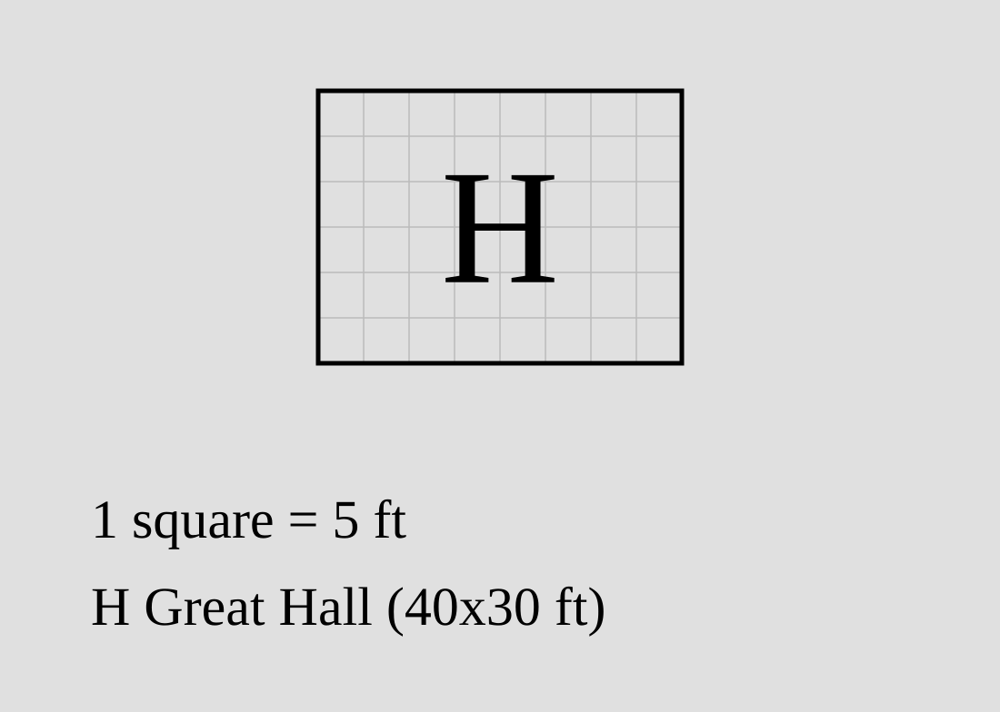
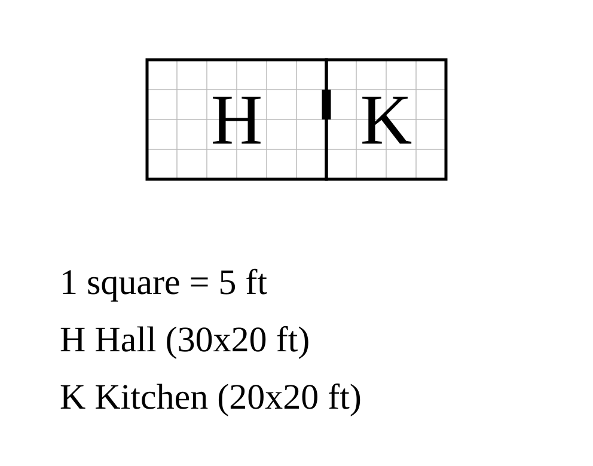
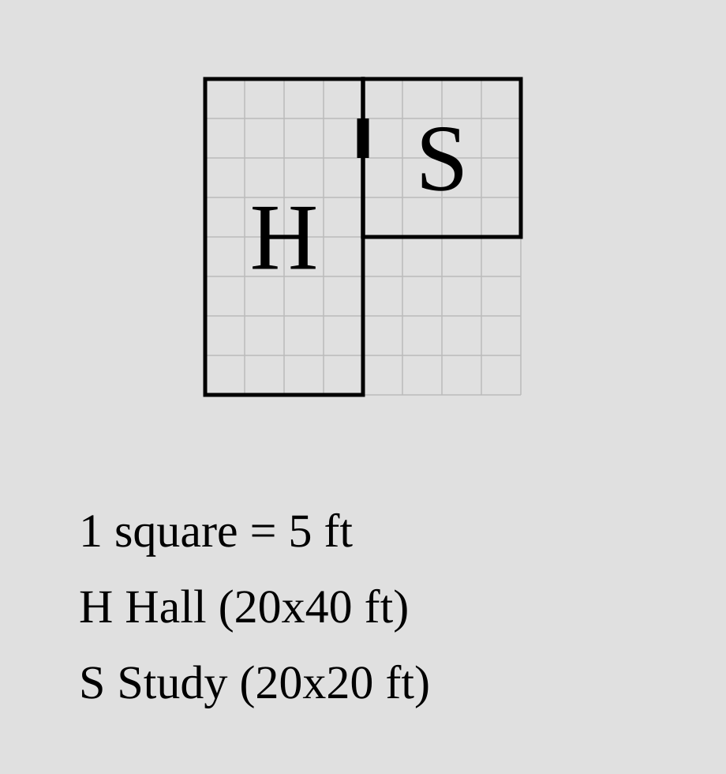
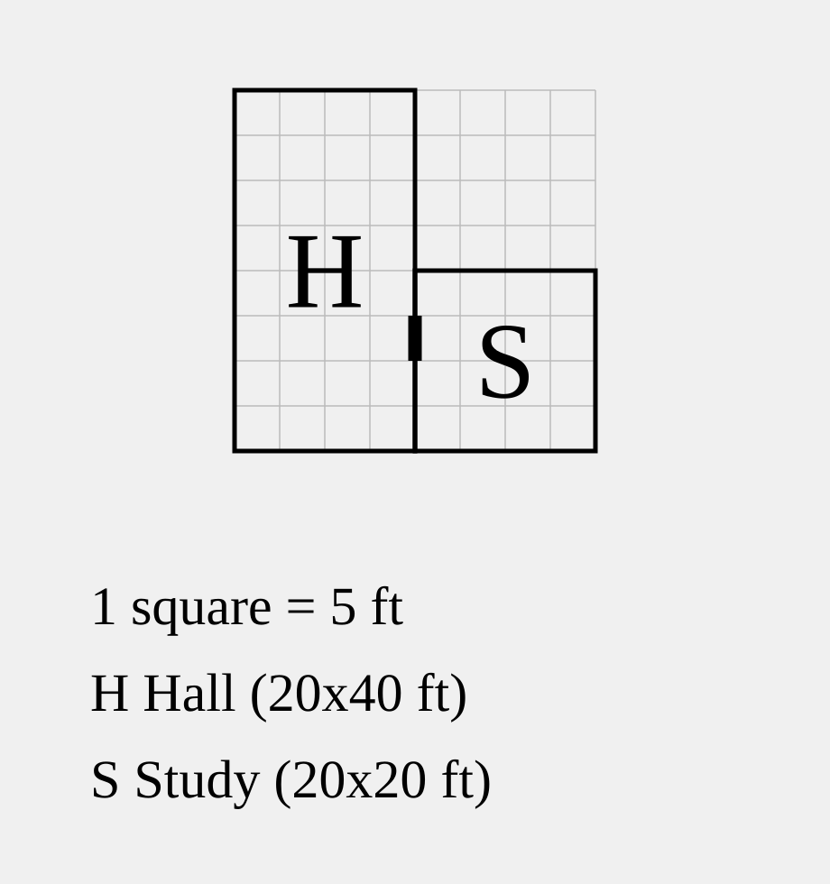

# Rooms

A `porta` plan is a list of rooms. Each room is a rectangle with a size, and
rather than give it coordinates you say how it sits against the rooms around it.
porta works out where everything lands.

```porta img/overview.svg
room hall    "Hall"    30x20 root
room parlour "Parlour" 20x20 left-of hall
room kitchen "Kitchen" 20x20 right-of hall
```


That's the whole idea: one `root` room to start from, and relations
(`left-of`, `right-of`, and so on) to hang the rest off. The short black marks
on the shared walls are doors, which porta adds for you. They have their own
page, [doors](door.md) — ignore them here.

## The `room` statement

One room per line:

```text
room <id> "<Name>" <W>x<H> [root] [<relation> <anchor> [modifiers] …]
```

### Id and name

`<id>` is how other rooms refer to this one: letters, digits, hyphens and
underscores, starting with a letter (`hall`, `store_room-2`). It is never drawn.
`"<Name>"` is the label shown on the plan, in double quotes so it can contain
spaces.

### Dimensions

`<W>x<H>` is the width and height in feet, so `40x30` is forty wide and thirty
tall. porta works on a 5-foot grid, so both numbers are multiples of 5.

```porta img/dimensions.svg
room hall "Great Hall" 40x30 root
```



## The root

Every plan needs exactly one room marked `root`. It is the fixed point
everything else is measured from: porta puts its top-left corner at the origin
and grows the plan outward. Zero roots, or more than one, is an error.

## Relations: attaching rooms

### The four relations

A relation places a room flush against another — its **anchor**. There are
four, and they are page-relative, not compass:

- `up-of` / `down-of` — above / below the anchor
- `left-of` / `right-of` — beside the anchor

```porta img/one-relation.svg
room hall    "Hall"    30x20 root
room kitchen "Kitchen" 20x20 right-of hall
```



The kitchen's left wall meets the hall's right wall, flush — no gap, no overlap,
and no coordinates from you.

### One relation pins one axis

`right-of hall` settles where the kitchen sits *horizontally*: its left edge is
the hall's right edge. It says nothing about the vertical, so porta has to fill
that in.

### The free axis

The axis a relation leaves open is the **free axis**. By default porta lines up
the near edges. For a left/right relation that means the tops:

```porta img/free-axis.svg
room hall  "Hall"  20x40 root
room study "Study" 20x20 right-of hall
```



The study is shorter than the hall, so their tops sit flush and the south-east
corner is left open. That default — flush near edges — is `align=start`, and you
can override it.

## Alignment

### `align=start`

The default: near edges flush (tops for left/right relations, left edges for
up/down). Tiled rooms form a continuous wall, which is usually what you want.

### `align=end`

Flush the *far* edges instead — bottoms, or right edges:

```porta img/align-end.svg
room hall  "Hall"  20x40 root
room study "Study" 20x20 right-of hall align=end
```



Now the study drops to the hall's foot.

## Shifting

`shift=N` nudges a room along its free axis after aligning. Positive is down
(for left/right relations) or right (for up/down), measured in feet on the grid:

```porta img/shift.svg
room hall  "Hall"  20x40 root
room study "Study" 20x20 right-of hall shift=10
```


A shift has to leave the rooms sharing some wall. Slide a room clear off its
anchor and porta complains, because the relation no longer means anything.

## Pinning both axes

Give a room a relation on each axis and both are fixed, with no free axis left:

```porta img/both-axes.svg
room entrance "Entrance"   20x20 root
room kitchen  "Kitchen"    20x30 left-of entrance
room hall     "Great Hall" 40x30 up-of entrance right-of kitchen
```


The hall's `y` comes from `up-of entrance` and its `x` from `right-of kitchen`.

### Coordinate-only pins

Notice where the hall meets the kitchen: they touch only at a corner.
`right-of kitchen` still did its job — it pinned the hall's horizontal position
— but the two rooms don't actually share a wall. That is fine, and often what
you want: a relation can carry a position without forming a shared wall. (Two
relations on the *same* axis are stricter; see the next section.)

## Same-axis relations

Two relations on the same axis box a room in from both sides.

### Opposite directions: snug-fit

Put a room `right-of` one and `left-of` another and it has to fill the space
between them exactly. porta checks the width against the gap and errors if they
disagree:

```porta img/snug-fit.svg
room a "A" 40x20 root
room b "B" 20x20 down-of a
room d "D" 20x20 down-of a shift=30
room c "C" 10x20 right-of b left-of d
```


`c` drops into the ten-foot gap between `b` and `d`. You don't have to work the
width out yourself, either — see `?` below.

### Same direction: a shared edge

`left-of` two rooms at once puts the room beside both. The two anchors have to
present the same edge, or there would be nowhere consistent to put it:

```porta img/same-direction.svg
room a "A" 20x10 root
room b "B" 20x10 down-of a
room c "C" 10x20 left-of a left-of b
```


`c` runs down the left of both `a` and `b`. If their left edges didn't line up,
that's an error — and unlike the corner-touch above, a same-axis relation does
have to form a real shared wall.

## Auto dimensions: `?`

Often a room's size is really dictated by its neighbours, and spelling the
number out is just a chance to get it wrong. Write `?` in place of a dimension
and porta solves it.

### Match an anchor's wall

A `?` grows the room to fill the wall it shares with its anchor:

```porta img/match-anchor.svg
room hall  "Hall"  20x40 root
room study "Study" 20x? right-of hall
```


`20x?` makes the study as tall as the hall — compare [the free-axis
example](#the-free-axis), where a fixed `20x20` left a gap. (More precisely, the
`?` runs from whichever edge the room is already pinned by out to the anchor's
far edge, so a shifted or part-placed room fills only what is left.)

### Fill a snug-fit gap

On an axis pinned from both sides, a `?` *is* the gap — the snug-fit width,
computed for you. The `c` in the snug-fit example could just as well be `?x20`.

### Union: span several walls

When more than one wall sizes the same `?`, the room spans all of them. Make the
`c` from before `10x?` and it stretches to cover both `a` and `b`:

```porta img/union.svg
room a "A" 20x10 root
room b "B" 20x20 down-of a
room c "C" 10x? left-of a left-of b
```


`a` is ten tall and `b` is twenty; `c` comes out thirty, the two together.

### When a `?` can't be solved

A `?` needs something to measure against. porta rejects one with no wall to size
from (a root, or an axis with no relation), and one that resolves to nothing (a
shift that has pushed the room clear of its anchor).

## How positions are resolved

### Propagation from the root (a graph, not a solver)

You might expect a tool like this to run a constraint solver. It doesn't, and it
doesn't need to. Because every room carries its own size and attaches flush,
there is nothing numerical to search for: once you know where a room's anchor
is, the room's own position follows straight away.

So porta places the root at the origin, then keeps placing any room whose
anchors are already down, until none are left. It is a single pass over a
dependency graph — a room depends on its anchors, they depend on theirs, back to
the root. A room that depends on itself (directly or round a loop) is a cycle,
and a room that never connects back to the root is disconnected. Both are
errors.

### The coordinate system

Coordinates are in feet. `x` increases to the right (east) and `y` increases
*downward* (south), matching the screen, so nothing is flipped behind the
scenes. A room's position is its top-left (north-west) corner, and the root's is
`(0, 0)`. Rooms placed `up-of` or `left-of` the root get negative coordinates,
which is expected.

### Resolution order, and how `?` fits in

`?` dimensions are solved in the same pass, just before each room is placed, so
by the time porta needs a room's size its anchors — and *their* sizes — are
already known. A `?` can even point at another `?`: the chain resolves in order,
with no special handling.

### Eyeballing with `--debug-ascii`

The relational style is compact, but the cost is that you can't always picture
the result. `porta draw plan.porta --debug-ascii` prints the solved layout as a
grid of letters, one glyph per room, so you can check the shape without opening
the SVG:

```text
H H H H H H K K K K
H H H H H H K K K K
H H H H H H K K K K
H H H H H H K K K K

H=hall  K=kitchen
```

## What porta rejects

porta would rather stop than guess, so each of these is an error, reported with
the room and line at fault:

- **No single root** — zero rooms marked `root`, or several.
- **Unknown anchor** — a relation naming a room id that doesn't exist.
- **A cycle** — rooms whose placement depends on one another.
- **A disconnected room** — one that doesn't trace back to the root.
- **Overlap** — two rooms covering the same ground.
- **A non-flush same-axis relation** — two relations on one axis where the room
  fails to meet one of its anchors.
- **A snug-fit mismatch** — a room whose size doesn't fill the gap it's pinned
  into.
- **An unsolvable `?`** — nothing for it to size against.

## Putting it together

```porta img/capstone.svg
room hall    "Hall"    40x30 root
room parlour "Parlour" 20x30 left-of hall
room kitchen "Kitchen" 20x30 right-of hall
room porch   "Porch"   20x10 down-of hall align=end
room cellar  "Cellar"  ?x20  down-of parlour
```


A hall with two wings, a porch tucked under its east end with `align=end`, and a
cellar that takes the parlour's width with `?`. For a larger plan — once you've
met [doors](door.md) — see [`examples/manor.porta`](../examples/manor.porta).
