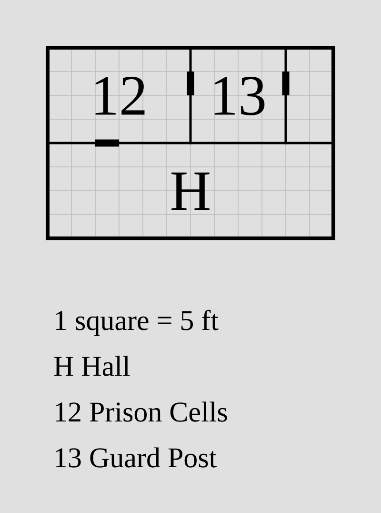
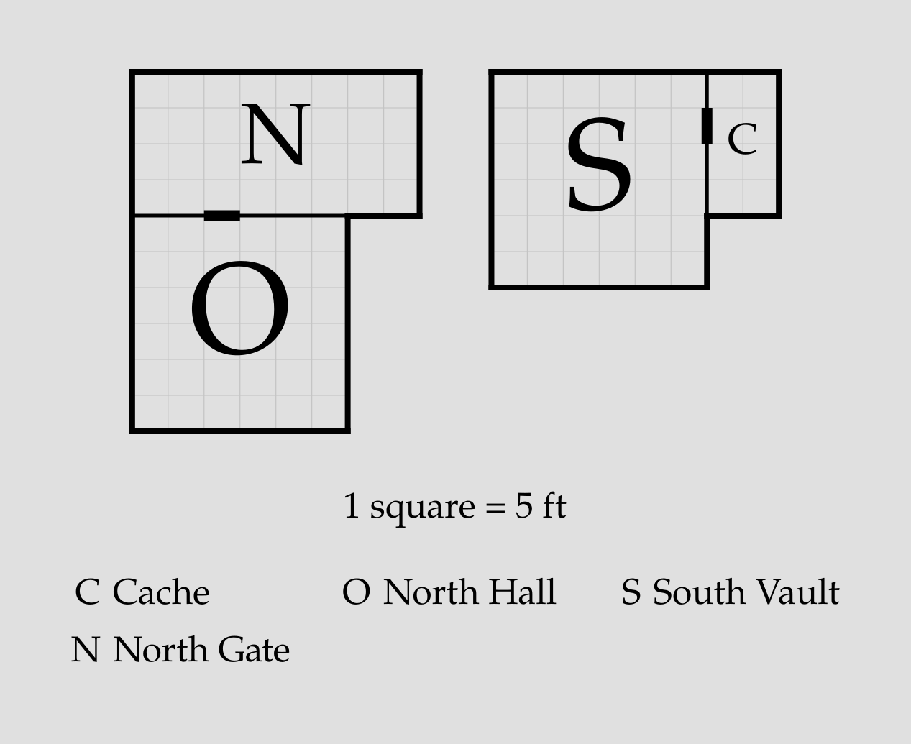

# Rooms

The core of a `porta` plan is a list of [rooms](#the-room-statement), linked by 
[relations](#relations) into a floorplan. With the exception of
the [root](#the-root), each room is positioned relative to one or more
**[anchors](#adjacency)** defined previously in the plan. `porta`
[resolves rooms](#resolution) outward from the root until
every room is placed.

```porta img/overview.svg
room hall    "Hall"    30x20 root
room parlour "Parlour" 20x20 left-of hall
room kitchen "Kitchen" 20x20 right-of hall
```


> [!NOTE]
> The short black marks on the shared walls are **doors**, which are
> added by default between adjoining rooms. Door syntax is described
> separately [here](door.md).

> [!NOTE]
> Each room is a **rectangle**. To make a non-rectangular room, group several
> rooms into one space with a [block](block.md).

## The `room` statement

A room is declared in a `porta` plan as follows:

```text
room <id> "<name>" <dimensions> [glyph="<glyph>"] <relations>
```

Each `room` statement consists of the following components in order:

1. A literal `room` keyword;
2. A [room ID](#room-id) used to point to that room elsewhere in the plan;
3. A [room name](#room-name) shown in the rendered map key (may be empty);
4. A [dimension declaration](#dimensions) of the form `WxH`;
5. An optional explicit [display glyph](#glyphs);
6. One or more [relations](#relations).

### Room ID

A room ID is the handle other parts of the `porta` plan use to refer to that
room. Its first available letter also supplies the room's default
[glyph](#glyphs) on the rendered map (the key maps glyphs back to names); the
id is otherwise not shown. An ID must match `[a-z][a-z0-9_-]*`: a lowercase
letter to start, followed by any number of lowercase letters, digits, hyphens,
or underscores.
Each ID must be unique within a plan, and can't match any of `porta`'s
reserved keywords.

> [!WARNING]
> At the time of writing, the following keywords are **reserved** in `porta`
> plans and cannot be used for room IDs:
> `root`, `door`, `no-door`, `outside`, `shift`, `align`, `up-of`, `down-of`,
> `left-of`, `right-of`

> [!NOTE]
> Valid IDs: `hall`, `store_room-2`, `wc1`.
> Invalid IDs: `Hall` (uppercase), `2nd_room` (leading digit),
> `dining room` (space), `left-of` (reserved keyword).

### Room name

A room name is the label given to that room in the rendered map's key. The name
slot is **required**, but may be left **empty** with `""`. 
A non-empty name must meet the following criteria:

- A single double-quoted string 1-40 characters long;
- Contains no double-quotes (literal `"`) internally;
- Contains only printable Unicode characters (no control characters);
- Starts and ends with non-whitespace printable characters;
- Fits on a single line – no linebreaks.

Names are interpreted literally, without escapes. All printable Unicode
is valid within a name, subject to the restrictions above.

### Glyphs

Each room is labeled on the rendered map by a short **glyph**, which the key
below the map maps back to the room's name. By default, `porta` assigns
glyphs automatically: the first letter of the room's [ID](#room-id)
(uppercased) that no other room has claimed, falling back to a generic pool.

An explicit glyph can be set instead with `glyph="..."`, placed after the
dimensions:

```porta img/glyphs.svg
room cells "Prison Cells" 30x20 root glyph="12"
room guard "Guard Post"   20x20 right-of cells glyph="13"
room store ""             10x20 right-of guard glyph=""
room hall  "Hall"         60x20 down-of cells
```



This is chiefly useful for transcribing source material whose areas are
already numbered: glyphs like `10` or `12a` can't be produced by automatic
assignment. An explicit glyph must be:

- 1-3 characters long;
- Double-quoted;
- Printable, with no whitespace.

The glyph is drawn verbatim in the room and in the key, scaled down when
needed to fit the room's width. Explicit glyphs must be **unique** across the
plan's rooms and [blocks](block.md) — a duplicate raises an error. Rooms
without an explicit glyph still receive automatic glyphs, which never collide
with the explicit ones.

The empty glyph `glyph=""` marks the room as **unlabeled**: no glyph is
drawn, and the room gets no key entry at all (`store` above). In the
[debug-ascii grid](../README.md#the-porta-tool), an unlabeled room's cells
render as `_`.

### Dimensions

The dimensions of a room statement defines that room's width and height
in feet. A dimension declaration takes the form `WxH`, where `W` and `H`
indicate width and height respectively. Each of `W` and `H` must either:

1. Be an integer positive multiple of 5 (`5`, `10`, `15`, etc.); or
2. Be `?`, prompting `porta` to set that dimension [automatically](#auto-dimensions)
   if possible.

> [!NOTE]
> Examples of valid dimension declarations: `30x40`, `10x?`, `?x50`, `?x?`

### Relations

A room's relations define its positioning relative to other rooms in
a `porta` plan. Each relation begins with a **relation keyword**, 
followed by zero or more **arguments**. Valid relation keywords are
`root` (which takes no arguments) and the four **direction keywords**:
`up-of`, `right-of`, `left-of` and `down-of`.

Each direction keyword takes a [room ID](#room-id) as its first 
argument, indicating the **anchor room** relative to which the 
new room must be positioned; subsequent arguments — [alignment](#alignment)
and [shifting](#shifting) — can refine the relative positioning of the new
room versus its anchor.

For more on relation syntax, see [below](#positioning-rooms).

## Positioning rooms

### The root

Every connected group of rooms must have exactly one `root` room,
defining the fixed point against which the other rooms in the group are
measured. Most plans are a single connected group with a single root;
`porta` puts the top-left corner of the root room at the origin of its
coordinate system and grows the plan outward from there. A plan can also
hold several [disconnected components](#disconnected-components), each
with its own root.

```porta img/root.svg
room r "Root room" 40x30 root
```


### Adjacency

A spatial relation places a room flush against its anchor in the
specified direction:

```porta img/adjacency.svg
room r "Root room" 10x10 root
room a "Left room" 15x10 left-of r
room b "Right room" 15x10 right-of r
room c "Up room" 10x15 up-of r
room d "Down room" 10x15 down-of r
```


Each adjacency declaration pins one end of one axis; the room's dimension
declaration sets the other. `up-of` and `down-of` pin the room's vertical
position; `left-of` and `right-of` pin its horizontal position. The axis
pinned by a relation is the **pinned axis**; the other is the **free axis**.

A room can have multiple adjacency relations. The simplest case is to pin
the room on both axes, leaving no free axis at all:

```porta img/corner.svg
room r "Root room" 10x10 root
room a "Right room" 15x10 right-of r
room b "Down room" 10x15 down-of r
room c "Corner room" 10x10 right-of b down-of a
```


A room can also be pinned on either side of the same axis:

```porta img/flank.svg
room r "Root room" 10x10 root
room a "Left room" 10x15 left-of r
room b "Right room" 10x15 right-of r
room c "Left-down room" 10x10 down-of a
room d "Right-down room" 10x10 down-of b
room e "Flanked room" 10x10 right-of c left-of d
```


Finally, a room can be pinned to multiple rooms on the same side:

```porta img/span.svg
room r "Root room" 10x10 root
room a "Down room" 10x10 down-of r
room b "Span room" 10x20 right-of r right-of a
```


In all cases, **a room must [share at least 5 feet of wall](#invalid-plans) with all of its anchors**.
If a room statement declares an anchor, but the dimensions of the room do not allow
it to sit flush with that room while meeting its other constraints, the plan is
invalid.

### Alignment

By default, a room is anchored to the start of the corresponding edge of its
anchor room: top for vertical edges, left for horizontal edges.

```porta img/align_default.svg
room r "Root room" 20x20 root
room a "Left room" 10x10 left-of r
room b "Right room" 10x10 right-of r
```


> [!NOTE]
> `porta` follows the same coordinate system as the SVG standard, so vertical
> position is measured from the top of the page, not the bottom.

Rooms can instead be aligned to the *end* of their anchor edges by adding an
`align=end` argument to the relevant relation.

```porta img/align_end.svg
room r "Root room" 20x20 root
room a "Left room" 10x10 left-of r align=end
room b "Right room" 10x10 right-of r align=end
```


If desired, a start-aligned anchor can be declared explicitly with an
`align=start` argument; this produces the same result as the default.

```porta img/align_start.svg
room r "Root room" 20x20 root
room a "Left room" 10x10 left-of r align=start
room b "Right room" 10x10 right-of r align=start
```


These arguments can be used in multi-relation room statements:

```porta img/flank_align.svg
room r "Root room" 10x10 root
room a "Left room" 10x25 left-of r
room b "Right room" 10x25 right-of r
room c "Flanked room" 10x10 right-of a align=end left-of b
```


For alignment to have an effect, the room to be aligned must have a free axis
along which its position can be modified. If both axes of a room are pinned,
alignment arguments will raise errors.

### Shifting

Like alignment, shifting modifies the position of a room along its free axis.
Applying a `shift=N` argument to a relation nudges the room `N` feet in the
positive direction (right/down); `shift=-N` nudges it `N` feet in the
negative direction (left/up). Shifting is applied **after alignment**.

```porta img/shift.svg
room r "Root room" 20x20 root
room a "Right room" 10x10 right-of r shift=5
room b "Left room" 10x10 left-of r shift=-5
room c "Down room" 10x10 down-of r align=end shift=-5
room d "Up room" 10x10 up-of r align=end shift=5
room e "Outer room" 10x10 right-of a shift=-5
```


As always, a room must [share at least 5 feet of wall](#invalid-plans) with each of its anchors
after shifting. Shifting a room fully off of its anchor produces an
invalid plan.

## Auto dimensions (`?`)

A dimension of `?` in a room statement instructs `porta` to derive that dimension
from the room's anchors. In the simplest case, the auto-derived dimension
simply matches the corresponding dimension of the anchor:

```porta img/auto-single.svg
room r "Root room" 20x20 root
room a "Right room" 20x? right-of r
room b "Down room" ?x20 down-of r
room c "Corner room" ?x? right-of b down-of a
```


If a room is shifted, `?` will extend it to the end of the anchor wall:

```porta img/auto-shift.svg
room r "Root room" 20x20 root
room a "Right room" 20x? right-of r shift=5
room b "Down room" ?x20 down-of r shift=-5
```


Special behavior is needed when a room has two anchors on the same axis. If these are on 
opposite sides, `?` will extend the new room to snugly fit between them:

```porta img/auto-flank.svg
room r "Root room" 10x10 root
room a "Left room" 10x15 left-of r
room b "Right room" 10x15 right-of r
room c "Left-down room" ?x10 down-of a
room d "Right-down room" ?x10 down-of b
room e "Flanked room" ?x? right-of c left-of d
```


If there are two anchors on the same side, `?` will extend the new room to cover both:

```porta img/auto-union.svg
room r "Root room" 20x10 root
room a "Down room" 20x20 down-of r
room b "Span room" 10x? left-of r left-of a
```


In all cases, a `?` needs something to measure against. `porta` will reject
auto dimensions when there is no wall to size from.

## Disconnected components

Relations chain rooms into connected groups — **components**. A plan may
contain several components, each with its own `root`; multiple `root`
rooms are only an error when two of them end up in the same component.
This suits iterative transcription of an existing map: model the regions
you understand first, preview them together, and join them with real
connecting rooms later.

```porta img/components.svg
room north-gate "North Gate" 40x20 root
room north-hall "North Hall" 30x30 down-of north-gate
room south-vault "South Vault" 30x30 root
room cache "Cache" 10x20 right-of south-vault
```



Each component is solved on its own, exactly like a single-component
plan. The solved components are then packed into a west-to-east row, in
order of their first room's appearance in the file: each component after
the first is translated whole — its internal geometry untouched — so
that its bounding box starts 10 feet east of the previous one, top edges
aligned. Packed components are never adjacent, so a door between them
(or a block spanning them) is invalid; to join components into one
continuous plan, link them.

### Linking components

A `link` statement joins two components through a relation between one
room from each:

```porta img/link.svg
room north-gate "North Gate" 40x20 root
room north-hall "North Hall" 30x30 down-of north-gate
room south-vault "South Vault" 30x30 root
room cache "Cache" 10x20 right-of south-vault
link south-vault down-of north-hall
```


A link reads exactly like a [relation](#relations): the first room's
whole component is translated so that room sits flush in the given
direction of the second room. The usual 5-foot shared-wall minimum
applies, `align=` and `shift=` act on the free axis, and the shared wall
takes a default door, with `door=`, `no-door`, `open`, and `secret` all
available. Only the component's translation changes — every room keeps
its internal geometry, relations, and root — and once linked flush, the
two components' rooms are genuinely adjacent, so standalone `door`
statements between them work too.

Links may chain any number of components, and several links may
constrain the same components as long as they agree; contradictory
links are an error. Linked components remain separate components, each
with its own root. That makes a link easy to retire: when you replace
it with real connecting geometry, the two parts become one component —
and one component allows only one root — so the link and one of the
roots are removed together.

## Resolution

In `porta`, rooms are placed into the coordinate system by building and
traversing a dependency graph. The root is placed at the origin, rooms
anchored to the root are placed in relation to it, rooms anchored to
*those* rooms are placed, and so on until no rooms are left. Cycles,
rootless components, and irresolvable placements raise errors as
invalid plans. Because of this directed acyclic structure, the whole
plan can be resolved in a single pass, and no constraint solver is needed.

The coordinate system is measured in feet, with the `x`-axis increasing
to the right and the `y`-axis increasing downward. The top-left corner
of the root is placed at `(0,0)`; rooms above or to the left of the root
have negative coordinates. Each room is defined by the coordinates of its
top-left corner plus its dimensions. When a plan has several components,
only the first keeps its literal coordinates; the rest are translated
into the packed row.

Auto-dimensions (`?`) are resolved just before each room is placed, at which
point the position and dimensions of its anchors are already known. As a
result, a `?` dimension can be anchored relative to another `?` dimension,
as long as the chain eventually resolves to an explicit value.

## Invalid plans

The DAG-traversal approach adopted by `porta` requires each room to be fully
defined at the time of its placement, and for each room to share at least
5 feet of wall with each of its anchors. The following are all invalid
under this schema and will raise errors:

- A [connected component](#disconnected-components) with 0 or multiple roots
- Non-existent anchors
- Cyclic room dependencies
- Overlaps between rooms
- Gaps between a room and its anchor
- Corner-only anchor contact
- Unsolvable `?` dimensions
- Duplicate explicit [glyphs](#glyphs)

## Putting it together

```porta img/capstone.svg
room hall     "Hall"          20x40 root
room drawing  "Drawing Room"  30x40 left-of hall
room dining   "Dining Room"   30x20 right-of hall
room kitchen  "Kitchen"       30x20 right-of hall align=end
room pantry   "Pantry"        10x?  right-of dining right-of kitchen
room porch    "Porch"         20x10 down-of hall
room cloak    "Cloakroom"     10x10 down-of drawing left-of porch
room scullery "Scullery"      15x10 down-of kitchen align=end shift=-5
room passage  "Passage"       ?x10  right-of porch left-of scullery
```


