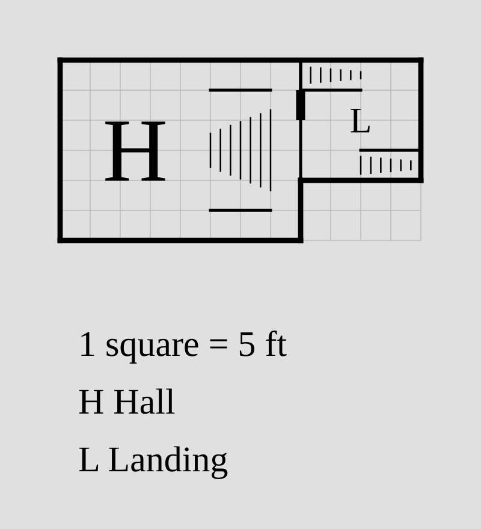
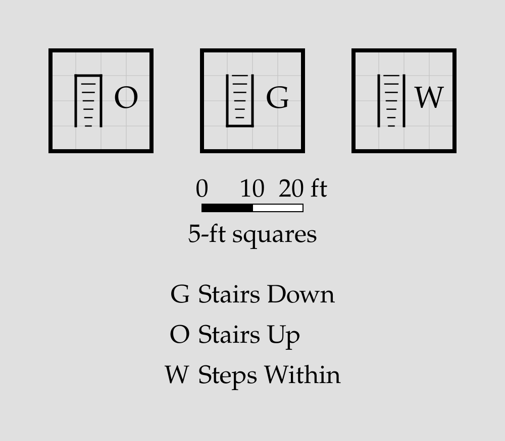
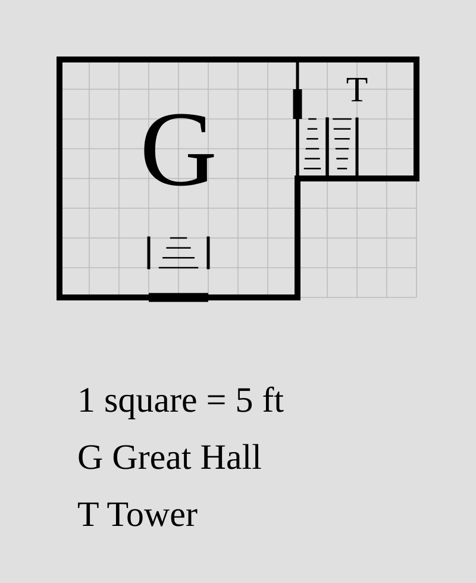

# Stairs

A **stairs** statement draws a flight of stairs inside a [room](room.md),
recording whether it leads up off this floor, down off it, or between two
levels within the floor:

```porta img/stairs.svg
room hall "Hall" 40x30 root
room landing "Landing" 20x20 right-of hall
stairs in hall down=left size=10x20 at=25,5
stairs up landing down=right at=0,0
stairs down landing down=right at=10,15
```



## The `stairs` statement

```
stairs <sense> <room> down=<side> [size=<WxH>] [at=<X,Y>]
sense = up | down | in
side  = up | down | left | right
```

- **`<sense>`**: where the flight leads — `up` (to the floor above), `down`
  (to the floor below), or `in` (a level change within this floor, such as
  steps up to a dais).
- **`<room>`**: the room the stairs are drawn in, by [ID](room.md#room-id).
  A room may contain any number of stairs. Naming a
  [block](block.md) member places the flight in that member.
- **`down=<side>`** (required): the plan direction that leads *downward* on
  the flight — the direction the rendered treads narrow toward.
- **`size=<WxH>`**: the footprint in feet (grid multiples). Defaults to one
  grid square across the run and two along it (`10x5` for a horizontal run,
  `5x10` for a vertical one).
- **`at=<X,Y>`**: the footprint's top-left corner in feet from the room's
  own top-left (NW) corner, on the grid. Defaults to centred in the room
  (rounded down to the grid).
Where a flight leads (which floor, which room) is not modelled.

## Reading the symbol

The treads narrow toward the downhill end of the flight — broad steps at
the top shrinking toward the drop. The sides with a solid wall line are
closed; the open sides (marked only by the thin end tread) are the
entrances, and they distinguish the three senses:

```porta img/stairs-senses.svg
room going-up "Stairs Up" 20x20 root
room going-down "Stairs Down" 20x20 root
room within "Steps Within" 20x20 root
stairs up going-up down=down
stairs down going-down down=down
stairs in within down=down
```



- **`up`** opens at the narrow (downhill) end: you enter at the bottom of
  the flight and climb away off the floor.
- **`down`** opens at the broad (top) end: you enter at the top and
  descend away off the floor.
- **`in`** opens at both ends — both the upper and lower levels are on this
  floor, and only the flanks are walled.

## Invalid stairs

`porta` rejects stairs it can't place:

- A room ID that isn't a room.
- A footprint (default or explicit) that does not fit inside the room.
- Two stair footprints that overlap.
- An off-grid `size=` or `at=`, or a missing `down=`.
- An inaccessible flight: an entrance flush with a stretch of wall that has
  no door on it. (A flight whose *closed* far side sits on a wall is fine —
  the run continues past it on another level — and so is an entrance
  covered by a door, like a stair closet entered from the next room, or
  one opening across a block-internal boundary.)
- A blocked door: one whose span meets a closed side or flank of a
  footprint, so it would open into the back of the staircase.

## Putting it together

```porta img/stairs-capstone.svg
room hall "" 40x30 root
room dais "" 40x10 down-of hall
block great "Great Hall" hall dais
room tower "Tower" 20x20 right-of hall
stairs in dais down=up size=10x5 at=15,0
stairs up tower down=up at=0,10
stairs down tower down=down at=5,10
door=10 dais outside down
```

The dais is a [block](block.md) member, so the steps' upper entrance opens
across the suppressed hall–dais boundary into the shared space — no door
needed there. To mark the level change itself along the rest of that
boundary, see [dividers](block.md#dividers).


