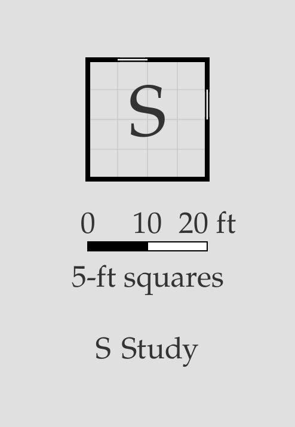
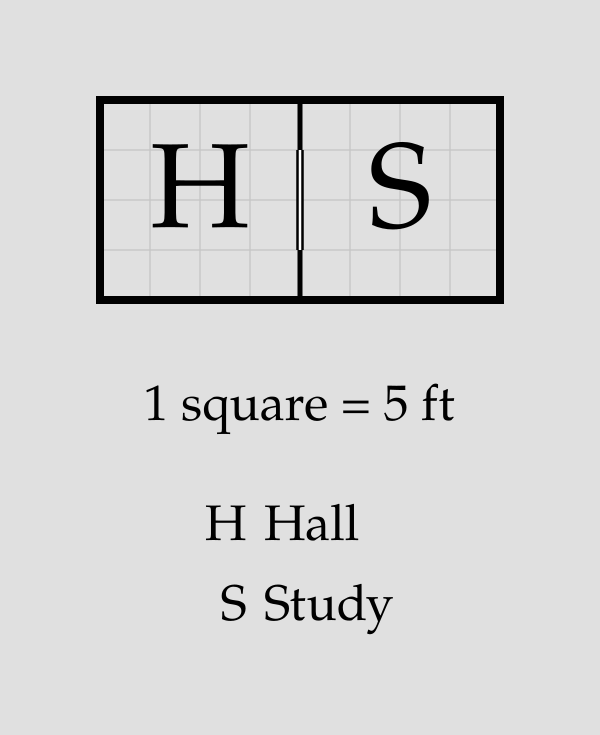
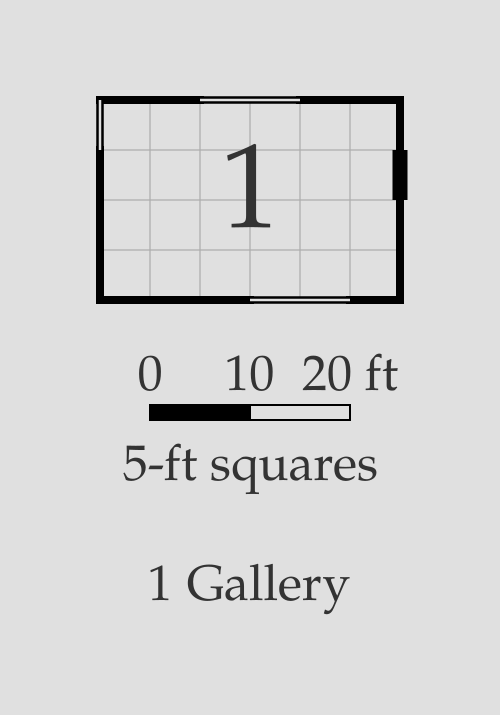
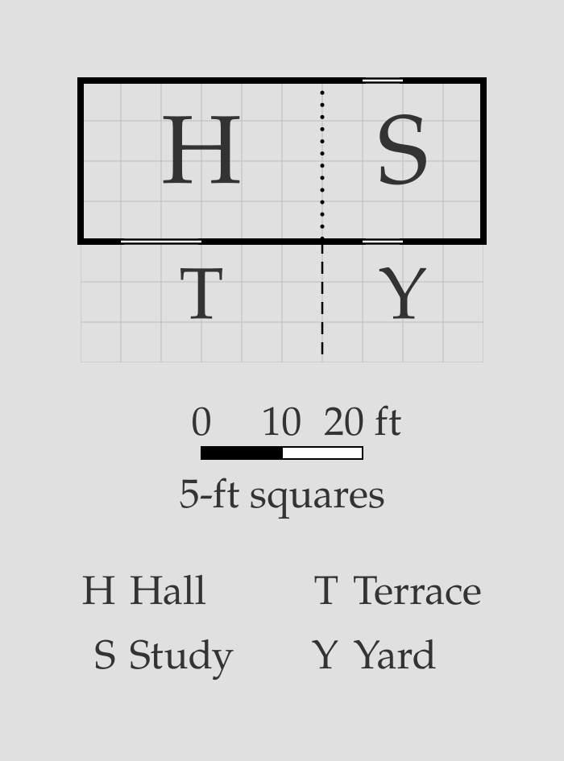
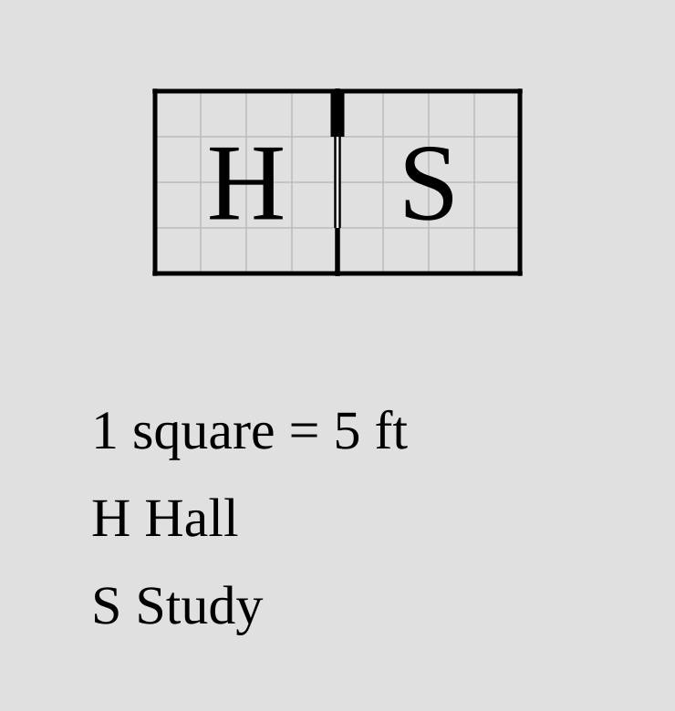
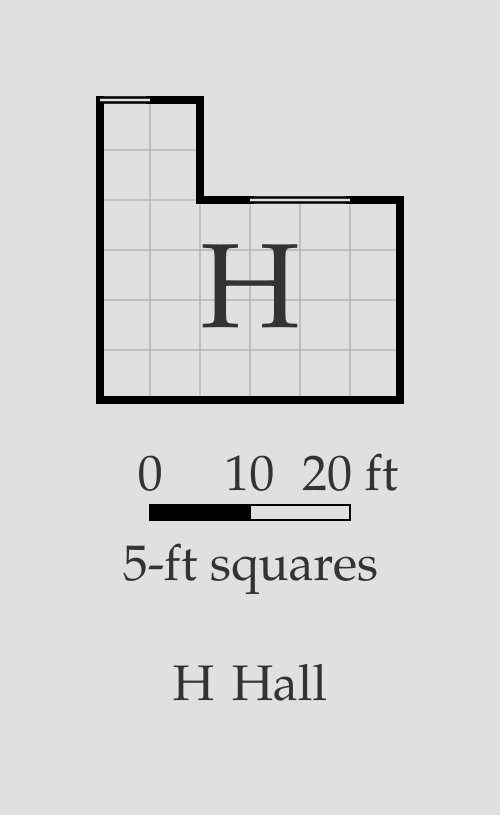
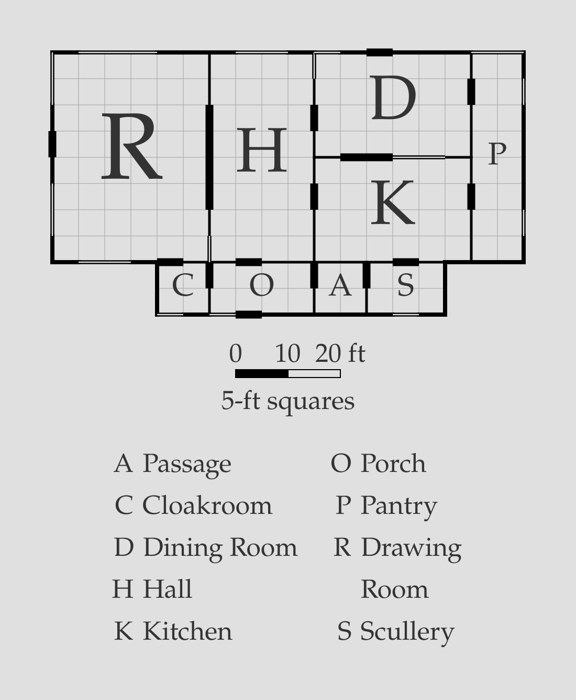

# Windows

A standalone `window` statement adds one plain window, either between two
rooms or to the outside. Windows render in SVG as two thin parallel lines
with white interiors, replacing the wall across the window's span. The interior
stays white even on a colored background. Like doors, windows do not appear
in the ASCII debug view.

## Placement and sizing

Windows use the same targets, width and offset notation as standalone
[doors](door.md#the-door-statement):

- `window[=W][@O] <a> <b>` places a window on two rooms' shared wall.
- `window[=W][@O] <room> outside <side>` places one on an exterior side:
  `up`, `down`, `left`, or `right`.

The default is 5 feet wide and centered, with its start rounded down to the
5-foot grid (leftward or upward), exactly like a door. Width is a positive
multiple of 5 feet; offset is a non-negative multiple of 5 feet. Offsets
are measured from the left or top of the shared wall for interior windows,
or the room's full selected side for exterior windows. Automatic width (`?`) is
supported for doors only; give windows a numeric width.

Windows are always explicitly declared. They do not replace default doors
automatically: use `no-door` when replacing a relation's door with a window.
Only standalone window statements are supported; windows cannot be relation
modifiers and do not accept `open` or `secret` attributes.

```porta img/window-default.svg
room study "Study" 20x20 root
window study outside up
window study outside right
```



```porta img/window-interior.svg
room hall "Hall" 20x20 root
room study "Study" 20x20 right-of hall no-door
window=10@5 hall study
```



`window=W` sets width, `window@O` sets offset, and `window=W@O` sets both:

```porta img/window-overrides.svg
room gallery "Gallery" 30x20 root
window=10 gallery outside up
window@0 gallery outside left
window=10@15 gallery outside down
door gallery outside right
```



## Windows facing outdoor spaces

A window between an interior room and a named [exterior room](room.md#exterior-spaces)
cuts the stronger exterior wall. Use both room IDs, even when naming the outdoor
room first. Windows between two exterior rooms, or from an exterior room to
`outside`, are errors because those boundaries have no structural wall. Windows
inside one block remain suppressed with a warning, including outdoor blocks.

```porta img/window-outdoors.svg
room hall "Hall" 30x20 root
room terrace "Terrace" ?x15 exterior down-of hall no-door
room yard "Yard" 20x15 exterior right-of terrace
room study "Study" 20x20 right-of hall door=? open
window=10@5 hall terrace
window yard study
window study outside up
```



An automatic full-wall door occupies its entire shared span, so a window cannot
share that span with it, whether the door is solid, open, or secret. Windows
never provide stair access through an indoor/outdoor wall.

## Valid wall spans

As with doors, the entire window must fit on its wall. Interior windows
require a shared wall; exterior windows require that no other room sit flush
against any part of their span. An exposed portion of a partially shared
side is valid. Centering uses the full side and does not search for a free
span; set an explicit offset when necessary.

Windows cannot overlap other windows or any door, including open and secret
doors. Spans may touch at their endpoints, following the door overlap rule.
A window does not provide an entrance for [stairs](stairs.md).

A door and window can share a wall when their spans do not overlap:

```porta img/window-shared-wall.svg
room hall "Hall" 20x20 root
room study "Study" 20x20 right-of hall door@0
window=10@5 hall study
```



For a [block](block.md), name individual member rooms, not the block id.
A window between members of the same block is suppressed with a warning,
just like a door, because their shared wall is already removed. Windows
between a member and a room outside the block, or on exposed member edges,
cut the block's outline.

```porta img/window-block.svg
room main "" 30x20 root
room wing "" 10x10 up-of main
block hall "Hall" main wing
window=10@15 main outside up
window wing outside up
```



Exterior currently means there is no adjacent room across the window span.
Explicit exterior areas ([issue #46](https://github.com/willbradshaw/porta/issues/46))
are not implemented in this version, so windows facing such areas have no
separate policy yet. Repeated-window groups and window styles are not supported.

## Putting it together

This manor combines broad exterior windows in the drawing room, smaller
windows in service rooms, and interior windows beside doors. The dining
room has both an exterior door and a window on its north wall; its shared
wall with the kitchen also has a door and window placed end to end.
The pantry's height and passage's width are resolved from their neighbors.

```porta img/window-capstone.svg
room hall     "Hall"          20x40 root
room drawing  "Drawing Room"  30x40 left-of hall door=20
room dining   "Dining Room"   30x20 right-of hall door@10
room kitchen  "Kitchen"       30x20 right-of hall align=end
room pantry   "Pantry"        10x?  right-of dining right-of kitchen
room porch    "Porch"         20x10 down-of hall
room cloak    "Cloakroom"     10x10 down-of drawing left-of porch
room scullery "Scullery"      15x10 down-of kitchen align=end shift=-5
room passage  "Passage"       ?x10  right-of porch left-of scullery

door=10@5 dining kitchen
door porch outside down
door dining outside up
door drawing outside left

window=10 hall outside up
window=15 drawing outside up
window=10@0 drawing outside left
window=10@25 drawing outside left
window=10@5 drawing outside down
window@0 dining outside up
window=10 pantry outside up
window@5 pantry outside right
window@30 pantry outside right
window scullery outside down
window cloak outside down
window@0 porch outside down

window@0 hall dining
window=10@15 dining kitchen
window@35 drawing hall
```


